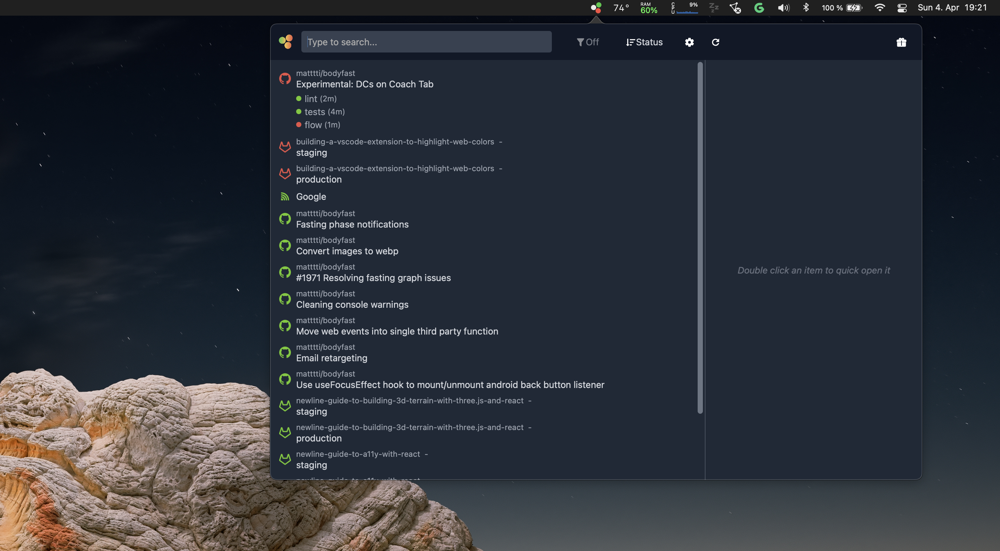

Welcome to newline's **Building React Native apps for Mac** course. We will learn how to build native macOS apps using [React-Native-macOS](https://github.com/microsoft/react-native-macos), [Typescript](http://typescriptlang.org), [MobX](https://mobx.js.org/README.html), [Tailwind](https://tailwindcss.com) and a few other Swift and JavaScript libraries.

My name is **Oscar** and I'm the creator of this course. I'm a Software Engineer from Bolivia living in Germany. I have worked as a team lead for a bunch of companies. Over the years I have worked a lot with React Native on mobiles, but since Microsoft released their port of React Native for macOS I jumped on the bandwagon and created [CI Demon](https://apps.apple.com/de/app/ci-demon/id1560355863?l=en&mt=12). The framework is so new that I've had to develop some new ideas and techniques, and together with **newline** we decided it was a good idea to create a course for people interested in developing desktop apps for macOS.

:::note
CI Demon was my first react-native-macos app. It condenses all your CI information in the macOS status bar. It started as a native SwiftUI app, but developing an app with native technologies was slow and frustrating, switching to React Native not only allowed me to leverage all my experience with React, but to keep all the benefits of native technologies.
:::

## Is this course for you?

This course is meant for React Native developers who want to start developing macOS apps, and also for native developers who want to start developing in React Native. This means we have to maintain a certain balance and cannot delve too deeply into any aspect without leaving either group behind. 

## Course summary

The course is divided into four modules.

### Module 1: Getting started

We will take a high-level overview of React-Native-macOS: why you should choose it, its advantages and disadvantages, state of tooling and other high-level topics.

### Module 2: Building the bones of our app

Here we will start writing some code. We'll start with a greenfield React Native app and start adding the libraries we need to develop a fully-fledged app, from state management to UI theming. We will also look at a nice way to organize your files and modules, to set you up for developing a real app.

:::important
If you are a seasoned **React Native developer** you'll potentially know a lot of this already, but you may still find some useful information, from setting up organized state management and folder structure to certain limitations of React-Native-macOS.
:::

:::important
If you are a **native macOS (or iOS) developer** and this is your first jump into the JavaScript world, this will set up a complete JavaScript pipeline and quickly get you up-to-date with the latest tooling so you can create the UI and core logic of your app.
:::

### Module 3: Advanced JavaScript topics

This module consists of the more advanced functionality on the JavaScript side, still valuable just technically harder to comprehend.

### Module 4: macOS-specific functionality

After covering the JavaScript basics of creating our app, we can really get our teeth into making our app leverage all the benefits of a desktop OS. For this course we will create an app to keep track of the books you have read. We will turn it into a menu bar app so you always have quick access to it, and we'll use a lot of the native macOS APIs to create really cool functionality.

:::important
If you are a **JavaScript developer**, you will learn a lot about native APIs. We will use Swift to develop the native functionality, which is easier to learn than objective-c. This is not a Swift course, so we won't go into the syntax in-depth but rather do a high-level pass, providing you with the code snippets you'll need.
:::

:::important
If you are a **macOS developer**, you will be familiar with a lot of the native code we are using, but you will learn how to connect this native code with the JavaScript environment, and you will learn more about the internals of React Native.
:::

### Module 5: Advanced macOS topics

This lesson builds upon the basic knowledge provided in the first modules modules to create truly new and advanced functionalities, pushing both React Native and the native APIs to their limit. It will be a bit more complex, with in-depth explanations of each functionality.

### For native developers

On the React Native and JavaScript parts we won't go too deeply into explaining the behavior of components or creating a full blown app, but rather create an architecture with which you can develop from a basic implementation into a real app, in a easy and scalable manner.

There are many great free and paid resources to learn pure React Native (including Newline's [own course](https://www.newline.co/30-days-of-react-native)), React, and the workings and principles of declarative UI, therefore this course will not attempt to teach you every single detail about React Native.

If you have used SwiftUI with the Combine framework, you will find React Native + Mobx (the library we will use for state management) to be similar.

### For React Native/JavaScript developers

For the JavaScript developers it will be a similar situation. I won't try to explain all the programming models of macOS, and trying to teach you Swift is also outside the scope of this course, but I will provide you enough information and code snippets for you to figure your way around. More importantly the focus is around macOS-specific functionality and pitfalls.

:::note
I should also mention that when I developed my first React-Native-macOS app, I had never developed a pure native app on macOS (or iOS). 

Everything you will see in the course I picked up by myself. If I can do it, so can you! However you might know a better way to achieve certain things, if so, feel free to [contact me](mailto:ospfranco@protonmail.com)!
:::