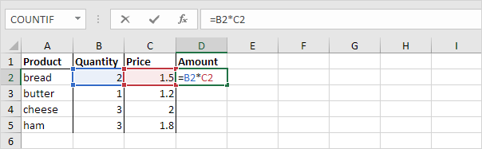

Now that we have a basic app running, we can start developing our app.

We are going to be a little counter-intuitive here and not start with our app's UI, but rather with state management. React comes with tools to manage state without the need for third party libraries, however, I  believe that React pollutes the thinking by mixing declarative UI with the need for having side-effects, and by modelling the state first with MobX and *then* creating the UI, we avoid a lot of confusion about the two.

### Introducing MobX

[MobX is a state management library](https://mobx.js.org/README.html#introduction) based on the observer pattern. For those not familiar with the observer pattern, MobX works by creating **observables**. An `Observable` is nothing more than an abstraction around basic values (numbers, strings, arrays, objects, etc.). Once a value has been wrapped in an `Observable`, it can be "observed" by other objects and functions. When the value inside of the `observable` changes, then the `observers` can react to the change. In the case of functions they will automatically re-run, and in the case of React components they will re-render. This is a incredibly powerful pattern to build reactive apps.

For those native devs who are familiar with the latest SwiftUI tooling, it is similar to the Combine framework, in the sense that it allows your UI to react to changes by observing objects.

React has an integrated way of handling state and other side-effects, they are called hooks.  In my opinion the problem with hooks is that they don't scale or compose when you have too many of them, or have to handle state across components. We will use some hooks in the course, but my advice is: keep them simple and only for tiny local state, and rely on MobX (or Redux or other state-management libraries) for the rest.

MobX is traditionally used with classes, but in this course we are going to go for a more functional approach and use factory functions, which allow for better composability while avoiding some of the syntax pitfalls of JavaScript.

We are going to start in the terminal by adding MobX into our dependencies:

```bash
yarn add mobx mobx-react-lite
```

:::important
Just to be clear `mobx` is the core library for observables and `mobx-react-lite` are bindings for our React-Native UI
:::

### Setting up a root store

We are going to organize our state by using `stores`.  A `store` is nothing more than a logical unit for grouping similar functionality and state.

All of our stores will be registered within a `root` store, and every sub-store has access to the `root` store in order for the different parts of the app to communicate and pass data.

We are going to start by creating a `Store.ts` file in the `./src` folder. This file will hold the `root` store. Afterwards we will create a `UI` store, which will hold data for the user interface. This is generic for now, but as your app grows you should break down your state into multiple stores.

```ts
// src/Store.ts
import { createUIStore } from "./stores/UI.store"

export interface IRootStore {
  ui: ReturnType<typeof createUIStore>
}

let createRootStore = (): IRootStore => {
  let store: any = {}
    
  store.ui = createUIStore(store)

  return store
}

export let root = createRootStore()
```

Let's walk over the code line by line.

First we import the `createUIStore` function from the `stores/UI.store.ts` file. This file and this function don't exist for now, but we will create it in the next step. The `createUIStore` function will do as its name describes - create an instance of a `UIStore`.

Next we will declare the type of our root store using a TypeScript **interface**. Whichever object "implements" this interface must fulfil all the fields and properties declared inside of it. TypeScript can and will automatically detect the type of most of the variables you create, but there are several reasons to declare interfaces explicitly. For example, in large code bases it helps the type checker to remain fast, and it also protects you from accidentally breaking implicit dependencies in your code. 

There is one problem with our code - it has a **circular dependency**. Because the `UIStore` will have access to the `root` object and the `root` contains the `UIStore`, the type checker will enter an **infinite loop** and because it cannot infer the type of the root store without determining the type of the UIStore, it can never infer the types of either. By explicitly declaring our type (i.e. `typeof createUIStore`) we help the type checker break this infinite loop and correctly infer the type for our `root` store.

Once the type of the root store is created, we can finally create the `createRootStore` function, which will be responsible for instantiating the `root` object. 

- First we will declare the function. Here you can see we are using our declared `IRootStore` interface which means whatever value this function returns it must match the type definition. 

- Afterwards we create an empty object where we will insert the different instances of the sub-stores. We will declare it with an `any` type, `any` being the super-type of all types in TypeScript, basically a joker card of types. We do this so we can freely insert values at runtime without the type checker screaming at us.

- Next we can invoke our theoretical `createUIStore` function. We pass it the `store` object, which will allow it to access other stores as our app grows. We then return our instance of the root store.

- Finally, we instantiate an object from our root store and export it from the file so it can be imported from our React code.

### Computed properties and actions

So far we've explained **observables**, but have not talked about **observers**. Observers can be either computed properties or React components. 

Computed properties are just that, properties that get computed (i.e. derived) from observables, in MobX they are just functions. **Computed properties (i.e. functions) are observers of any Observable used inside of them**. You don't need to worry about how this is achieved, you can just assume that if you use an Observable inside the body of the observer function, whenever any Observable changes, the function will automatically run and the result get updated. 

One place where you have seen this is in **Microsoft's Excel**! In Excel you can declare functions inside of the cells, and whenever one of the values in the function changes, the cell value gets automatically re-calculated, without you moving a finger.

:::note
If you are interested on how exactly this is achieved here is a [high level overview](https://mobx.js.org/understanding-reactivity.html) of the implementation, but basically a dependency tree is created based on access patterns and only re-runs the necessary observers.
:::



The last important part of the puzzle are actions. The problem with observables and JavaScript is that things can get out of sync; there are a lot of potential race conditions that could happen to mess up the state while observers are running. **Actions are a way to prevent race-conditions**. They ensure that state is correct, therefore you should only modify observables inside of an action.

## How to use observables?

Now have a tight grip on the basic MobX concepts, we are ready to create our store. In order to do this we need to import the `makeAutoObservable` function from the "mobx" package. `makeAutoObservable` takes care of enhancing all the properties of the object passed to it. We already went over the basic types mobx creates (observables, computed properties and actions), but `makeAutoObservable` takes an object and will automatically enhance the values inside of it into their corresponding types.

- Non-function properties become **observable** elements - for example the `books` array in our store will be enhanced as an observable.

- Getters become **computed properties** - in our case `get uppercasedBooks` will be a computed property.

- Other functions get wrapped in an **action**, `addBook` in this case.

### Setting up a UI store

We can now create our UI store. Create a `stores` folder in the `src` folder with a new `UI.store.ts` file inside:


```ts
// src/stores/UI.store.ts

import { makeAutoObservable } from "mobx";
import { IRootStore } from "../Store";

export let createUIStore = (root: IRootStore) => {
  let store = makeAutoObservable({
    books: [
      {
        title: "Lord of the rings",
        createdAt: "2021-02-02:T13:00:00Z"
      },
      {
        title: "Dune",
        createdAt: "2021-02-02:T13:02:00Z"
      },
      {
        title: "Neuromancer",
        createdAt: "2021-02-02:T13:04:00Z"
      }
    ],
    get uppercasedBooks(): {title: string, createdAt: string}[] {
      return store.books.map((book) => ({
        ...book,
        title: book.title.toUpperCase(),
      }))
    },
    addBook(title: string) {
      store.books.push({ title, createdAt: new Date().toISOString() })
    }
  });

  return store;
}
```

We start by importing the already mentioned `makeAutoObservable`. We also import the definition from the `root` store we created in the previous step, which will help us make sure we are not passing an incorrect root object when creating a store.

We can then create the `createUIStore`. It takes an instance of the `root` store. We will not use it for now, but it will become handy in the future.

In the body of the function we then create the `store` value. This time we will just let the type-checker infer the correct types from the implementation, so no need to declare an interface for it (but you could if you wanted to). 

Here we call the `makeAutoObservable` function - as explained it takes an object and it will take care of enhancing the internal values for us. 

Inside the store object, we create a `books` array, which contains some objects that will represent the user's favorite books. Remember this is a plain value, so it will be enhanced as an `Observable` array. 

Next we declare a getter (`get uppercasedBooks`). This will be enhanced as a **computed property**. It will take the list of books inside the `books` array and return an equivalent array with the titles uppercased (because we want to scream to the world that we love our books!). Now remember, computed properties re-run every time any `Observable` inside changes. In this case, we are accessing the `store.books` property - this means this getter will now re-run every time the books array changes. **You don't have to do anything else to gain reactivity, just using an observable inside a computed function is enough to make it reactive to changes**. 

Then we have the `addBook` function which is a mobx action that allows for safely updating the `store.books` array, and appends any title that gets passed to it.

Finally we return the created store object, which will be inserted in the `root` store.

### Connecting our stores to the UI

Now that we have a basic state management set up, we can start connecting it to our UI. To do that we are going to start by passing the instance of our store into a context provider.

Add the following lines at the end of your root store `Store.ts`:

```ts
// src/Store.ts

...

export let StoreContext = createContext<IRootStore>(root)
export let StoreProvider = StoreContext.Provider
export let useStore = () => useContext(StoreContext)
```

First we create a `StoreContext`. [Contexts](https://reactjs.org/docs/context.html) are a React mechanism to pass value along the UI tree. Since React works by passing props, if you have a deeply nested component, passing props along _N_ components is a waste of time, and contexts allows us to skip this. We create the context by calling the `createContext` function, also giving it our root store type, to make sure we are not putting any random value inside of it. Finally we pass it our instantiated root store.

Then we create a `StoreProvider`. A `Provider` is the part of the context that can be embedded in a React component (it is also a React component itself). Whatever component we put inside of this component, will have access to the object we passed to its context.

We have also created a `useStore` hook, which we will use later to access our root store from any component in our UI. We will explore hooks later, but for now let's just leave this as is.

Now we're going to update the entry point of our app in `App.tsx`. It will no longer hold any directly-renderable UI component, but it will become the point where we inject not only our store but any future providers, initialize certain libraries, etc.

```tsx
// src/App.tsx

import React from 'react';
import {Books} from './containers/Books.container';
import {root, StoreProvider} from './Store';

export const App = () => {
  return (
    <StoreProvider value={root}>
      <Books />
    </StoreProvider>
  );
};
```

First we import React. We need to import React in order to use JSX (the HTML-like syntax used to create React components). Later, we import a new `BookList` component, which doesn't exist yet - we will create it in a bit. Finally we import both our `root` store and our `StoreProvider` object.

The body of our App will consist of the `StoreProvider` component (we need to pass the instance of our `root` store one more time). Inside it we will place our UI components, but for now just the `BookList` component will go inside.

That's it! We can now create our `BookList` component. Create a new `containers` folder in the `src` folder and inside create a new `Books.container.tsx`.

```tsx
// src/containers/Books.container.tsx

import React from 'react'
import { observer } from 'mobx-react-lite'
import { View, Text, Button } from 'react-native'
import { useStore } from '../Store'

export const Books = observer(() => {
  // Do not de-structure the sub stores, otherwise you lose reactivity
  let root = useStore()

  return (
    <View>
      {root.ui.uppercasedBooks.map((book) => (
        <View key={book.title}>
          <Text>{book.title}</Text>
        </View>
      ))}
      <Button title="Add button" onPress={() => root.ui.addBook('Test')}/>
    </View>
  )

})
```

:::caution
We are going to make a distinction here between components registered as "navigable" routes and smaller components. Those which are the root of a specific route will be "containers" (in this case the `Books` container) and the rest will just be "components". This will help provide a scalable architecture. Once we set navigation this will become clearer.
:::

We first start by importing React. We then import the `observer` enhancer function from `mobx-react-lite`. This is important, because just as `makeAutoObservables` takes care of turning getters into observers, this helper will turn any React component into an observer. Like other observers, the React component will re-render itself whenever any of the observables inside change - very powerful indeed!

We then import some UI components from React Native, so we can build our UI: a View which can hold other components, a Text to hold any Texts and a Button to create... Buttons 😅.

The last import is our `useStore`, so we can access our `root` store inside of the component.

So now, we can finally declare our `Books` component. A React component is just a function - **notice we wrap it with the observer function**. 

Inside, the first thing we call is the `useStore` hook, and just like that we can now access our `root` store. If you are an advanced JavaScript developer, you might be tempted to deconstruct the root object to make your code more concise, but don't do that! You will lose all reactivity and spend a lot of time trying to work out why your component is not re-rendering, even though your observables are.

We can finally write a visual representation of the component. 
- We start by declaring a View that will hold all the elements, and inside of it we access our root store `uppercasedBooks` array and iterate over it with a `map` function. 
- `map` will walk over the array calling the function you pass to it with each element of the array as an argument. 
- Inside the body of the function we return the UI for each "book" entity, that is a View with a key prop (keys are necessary for React to efficiently re-render components - just make sure they are unique within each component) and a `Text` component inside of it with the title of the book.

We have also added a single button to do a simple test of adding a hardcoded book into our store, just to make sure everything is working correctly. You can see the `onPress` property will be fired when you press on it. Inside it we are calling our `root` store `addBook` action. If everything is set up correctly you should see how the list of books grows, without you having to tell the component to re-render or passing props - whenever the books array changes, the component takes care of re-rendering itself!
