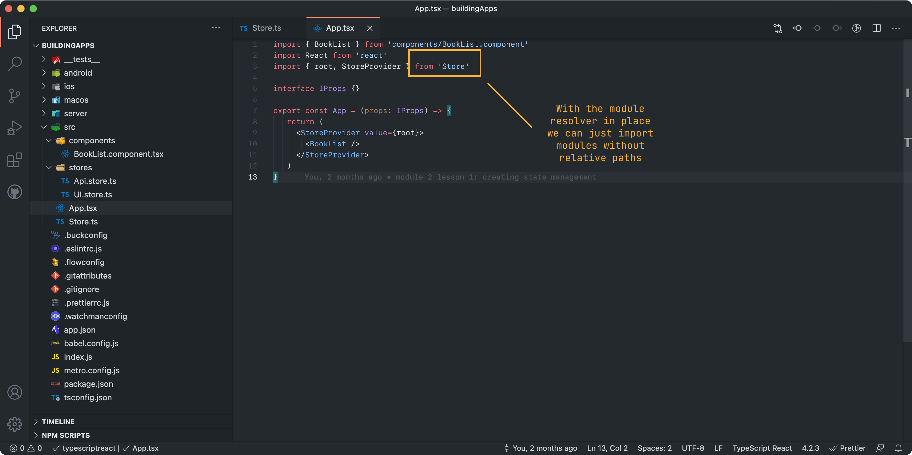
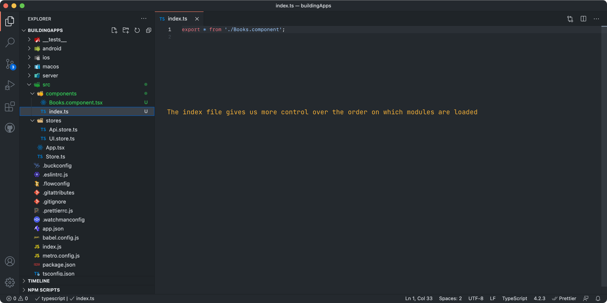

Before moving on, if you are new to the JavaScript world, you need to know there are some problems with importing JavaScript modules. 


Since JavaScript is loosely-typed, you need to import code directly from files. TypeScript does help with imports but it does so with relative paths (for example `'../../foo/bar'`) and if at some point you refactor your code or move it around, then it becomes a pain to change all your imports. We will solve this by using a module resolver (and TypeScript itself).

Another important problem is JavaScript modules get loaded in an unpredictable manner, so if you just trust your imports you might run into issues where some part of your app has not been initialized and you try to invoke it somehow. We will solve this by using a [specific folder structure](https://medium.com/visual-development/how-to-fix-nasty-circular-dependency-issues-once-and-for-all-in-javascript-TypeScript-a04c987cf0de).

### Setting up module sensible resolution

You may have noticed in the previous lesson that all of our import statements are relative.

```ts
import { useStore } from '../Store'
```

We will turn all our relative imports into absolute imports. First we need to take care of the JavaScript side, so start by adding the [Babel-plugin-module-resolver](https://github.com/tleunen/babel-plugin-module-resolver) into your dependencies: 

```bash
yarn add babel-plugin-module-resolver
```

:::note
Babel is a tool that transpiles our TypeScript into vanilla JavaScript, and it's already integrated into React Native by default. The plugin `module-resolver` allows you to add a "root" directory to all your imports. That is, every time you import a module **without** using a relative syntax (ex. `./`), it will assume you are requiring the file from the "root" directory of the project (in our case "./src"), and it will be transpiled accordingly.
:::

Next, on the root of the project, there is a `babel.config.js` file - open it and modify it so it ends up like this:

```js
module.exports = {
  presets: [`module:metro-react-native-babel-preset`],
  plugins: [
    [
      `module-resolver`,
      {
        root: [`./src`],
        extensions: [`.js`, `.ts`, `.tsx`, `.ios.js`, `.android.js`],
      },
    ],
  ],
}
```

Now, in order to make this work, you are going to have to close/quit your app and also the React Native packager (it should have opened in a new terminal when you ran the `run macos` command) and reset the transform cache by running `yarn nuke` - this will clear the caches and re-install your node dependencies.

This also needs to be configured in TypeScript. If you used the `tsconfig.json` code provided in a previous lesson it should already be done, but if not, you need to add to the file a `baseUrl` key, with `./src` value.

After that is done, you should be able to remove the relative paths from your imports and import directly as if you were on the `src` folder:

```ts
// No matter where, you now always have the same imports
import { useStore } from 'Store'
```



### Getting rid of circular dependencies and race conditions

Another problem when developing JavaScript is **circular dependencies**, that is module **A** requires module **B** which requires module **A**. This can lead to hard-to-detect bugs where things might not have been initialized on time. Another issue is sometimes you will need to call an initializer function for certain modules, but because you have little control over when a module is loaded, another part of your app might try to call un-initialized code.

In order to solve this problem (once and for all!) we are going to use an import/export trick for our different modules, making sure **we are in control** of which module gets loaded first.

In the `containers` folder add an `index.ts` file. Every time you add a new component in this folder, we are going to update this index file by exporting the component for other modules to consume, so right now we need to export our container's index file.

```ts
// src/containers/index.ts

export * from "./Books.container"
```

Once that is done, in your main `App.tsx` file, you can change the import statement of the container into:

```ts
// src/App.tsx

import { BookListContainer } from 'container'
```



There are two important aspects to this change. First, as you can see, your imports are much more abstracted away. Secondly and most importantly, by following this pattern you have a lot more control about what gets loaded first. Whatever you want to be loaded first, just move it up the list.

For the rest of course the code we will use assumes you have made these changes. You can just continue to use relative imports, but as your apps grow in complexity you will find this pattern really useful.

