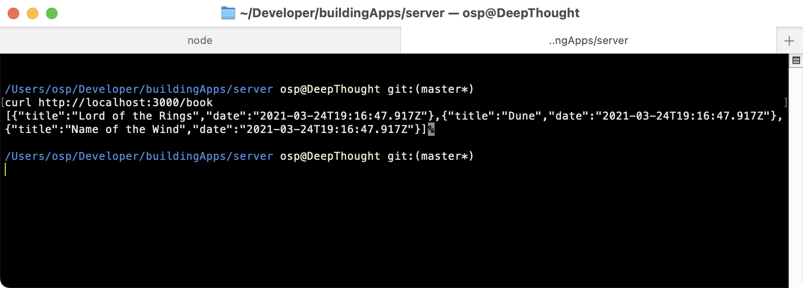
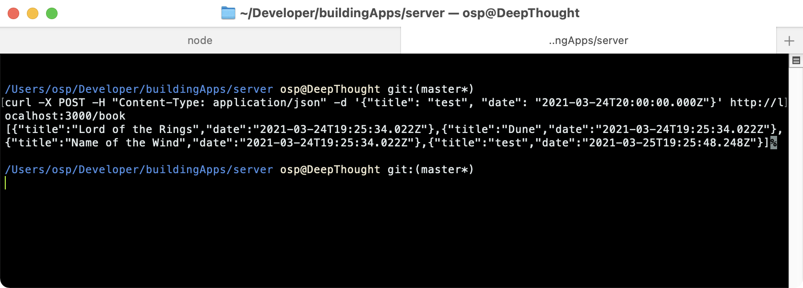

As stated in the beginning of the course, it's not my intention to teach you every little detail to create a pure React Native app, however connecting your app to a back-end is one of the musts for modern apps, therefore we will go over setting up a store for your network requests. For this I have created a little sample server in Node that we can use to set up a mocked back-end for our app. You can download it [here](./protected/server.zip), de-compress it and then in your terminal:

```
cd [book_server] && yarn && yarn start
```

## Our sample server

Let's explore this sample server a bit more. The server is a complete **mock implementation** - it has no disk persistence, meaning when the server stops, all the data you added to it will be lost. It's configured to start on port 3000 and it exposes two endpoints: `GET /book` which will retrieve the list of the user's books, and `POST /book` which will allow the user to create a new entry.

Let's just test it to see what it returns. Once you have started the server, go to your console, there you can run a simple `curl` command to query the server, it should give us the same objects we had in our store before:

```
curl http://localhost:3000/book
```

This will query the `GET` endpoint, which we will use to get the list of books for our user. You should see the following input:



Let's now test the `POST` endpoint. This endpoint takes a JSON body and will insert it into the in memory array of books:


```
curl -X POST -H "Content-Type: application/json" -d '{"title": "test", "date": "2021-03-24T20:00:00.000Z"}' http://localhost:3000/book
```

You should see the following output



:::important
You can see we have encoded a simple JSON object and sent it to the server. The server responds by returning the updated book array, with our new inserted value, so if you run the first curl command to get the books, it should now contain our newly added book as well.
:::

That's it for our basic server implementation -it's very simple, but it's just enough to get an idea of how to do network requests and handle state. We will use these two endpoints to retrieve and store updates from our client app.

## An HTTP layer

We will be working with a pure HTTP server, still the most common type of API out there. A lot of services now provide [GraphQL APIs](https://graphql.org/), but while GraphQL is great for certain use cases, it's a big topic of its own, therefore we won't go into it.

We will follow a basic layered architecture, **encapsulating all the networking code into a store**. None of the HTTP protocol abstractions should leak out of this store (headers, status codes, etc.). If you later decide to change the implementation details (for example, switch to GraphQL), then you only need to change the networking code, but your app's logic will remain the same.

Another important point to mention is that there are now several React libraries that attempt to abstract away the work of fetching data over the wire. Two good examples are [SWR](https://github.com/vercel/swr) and [React-Query](https://github.com/tannerlinsley/react-query). These libraries do abstract a lot of the work for you, which in theory sounds great, and if you are developing a simple product they might be the right decision. Later we will see that hooks come with their own set of drawbacks, and putting everything inside of a component with render cycles can make your components hard to reason about.

Our implementation will be relatively simple, but just as a teaser, you could easily enhance it with MobX to keep track of request states (or a download progress for example) by using observables. The beauty of MobX is that it is not architecture, but just a mechanism, so you can enhance pretty much anything with it. This can be both a blessing and a curse!