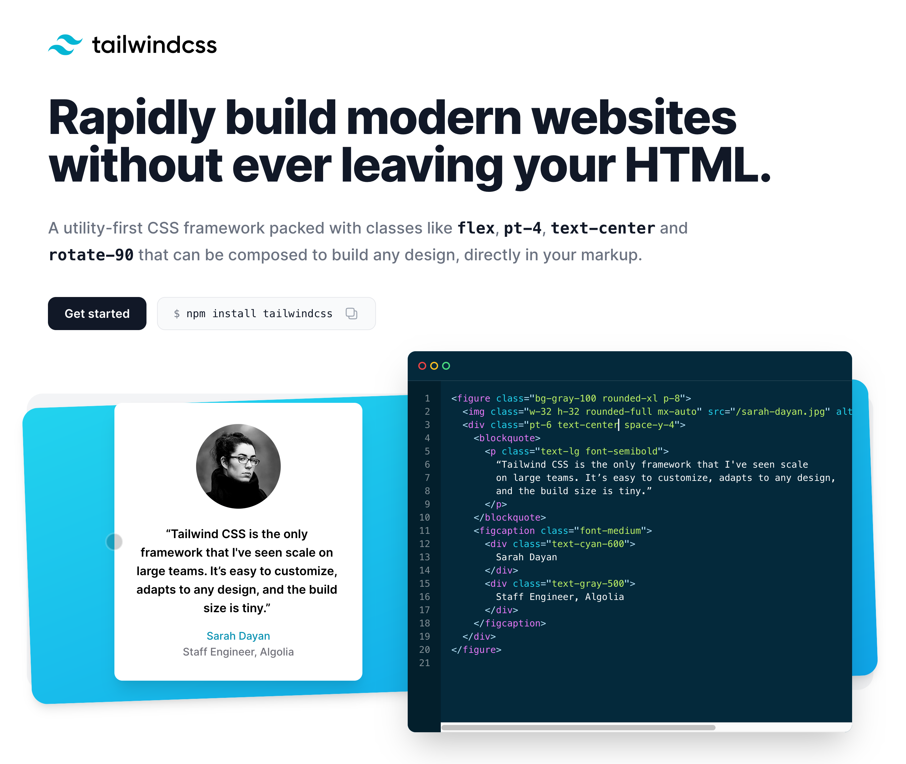

So far we have concerned ourselves with the non-visual parts of our application, but that does not mean we have forgotten about the visual aspects.

There are many ways to style a React Native application. You could pick a ready-made component framework like [react-native-paper](https://callstack.github.io/react-native-paper/), or a framework that allows you to use more CSS-like syntax and wrap pre-styled components like [styled-components](https://styled-components.com/docs/basics),  or you can hand-roll your own styles, which is time-consuming because you have to define your own scales, colors, grids etc.... there is a lot that needs to be configured and can go wrong.

In my opinion they are all very clunky approaches which tackle the problem at the wrong level of abstraction, so ideally we want something midway between these, a tool that gives us sensible defaults yet is easy to extend and customize to fit your application style. Let me introduce you to [TailwindCSS](http://tailwindcss.com)!



Tailwind works by having predefined utility classes, which you can compose by just calling them by name. Some people might not like having these long strings in their JSX, and you can make up your own mind about this. It is based on REM units, which will help your app scale properly when running on smaller or larger devices.

One more important thing to note is that React Native does not support CSS - it only has CSS-like syntax. Everything is laid out internally using a custom engine. Everything is also based on flex, and it doesn't have any of the inconsistencies you find in browsers, although some of the syntax and properties are not available.

### Installing

Now, Tailwind does not support React Native (since React Native does not really support CSS), so we are going to use [tailwind-rn](https://github.com/vadimdemedes/tailwind-rn). By default it comes with a lot of base classes from Tailwind, but it can also take a configuration file (which is important for customization).

Start adding the dependencies:

```bash
yarn add tailwindcss tailwind-rn
```

Afterwards let's give our book list a bit of style:

```tsx
// src/containers/Books.container

import tw from 'tailwind-rn'
import { observer } from 'mobx-react-lite'
import React, { useEffect, useState } from 'react'
import {View, Text, Button} from 'react-native'
import { useStore } from 'Store'

interface IProps {}

export const BookListContainer = observer((props: IProps) => {
  let root = useStore()
  let [title, setTitle] = useState('')

  useEffect(() => {
    root.ui.fetchBooks()
  }, [])

  return (
    <View style={tw('p-3')}>
      {root.ui.uppercasedBooks.map((book) => (
        <View key={book} style={tw('py-1')}>
          <Text style={tw('font-bold')}>{book.title}</Text>
          <Text style={tw('text-sm')}>{book.createdAt}</Text>
        </View>
      ))}

      <TextInput 
        value={title} 
        onChangeText={setTitle} 
        style={tw('rounded bg-gray-200')}
      />
      <Button 
        title="Add button" 
        onPress={() => root.ui.addBook(title)}
        style={tw('bg-blue-500 text-white justify-center p-3')}
      />
    </View>
  )
})
```

We'll start by importing tailwind-rn - this is a function that we will use to style our components. It takes a string and it will parse it to extract the name of Tailwind classes. There are too many utility classes for me to describe, but here are the ones we are using for our example:

- `rounded`: applies border-radius to a view
- `bg-blue/gray-500`: applies a background color to a view
- `p-[n]`: applies padding to a view
- `py-[n]`: applies vertical padding to a view
- `justify-center`: applies the `justifyContent: center` property to a view
- `text-sm`: applies small font to the text

Be sure to check out the [official documentation](https://tailwindcss.com/docs) to see all the available classes.

It's just basic styling for now, but it shows you how easily you can get started and create consistent spacing and theming in your app. Styling minor components is no longer the tedious task of moving backwards and forwards between files and objects in different locations.

If you have static styling you can also move the classes generated by the `tailwind-rn` library outside of your component code, which avoids re-creating them constantly and could improve performance.

In the next lesson we will customize Tailwind with our own colors (and other properties) to give our app a truly unique look. 