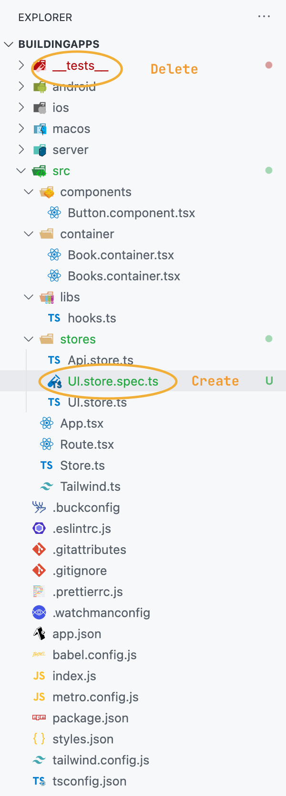
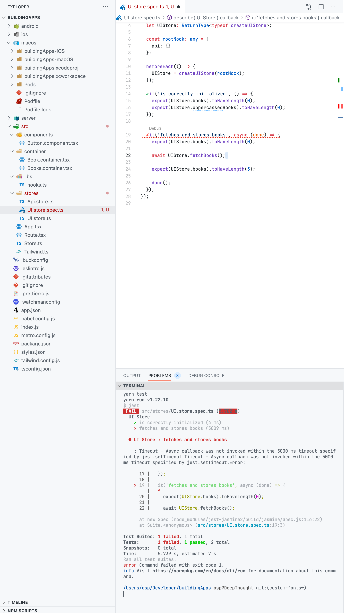

For the final lesson on the JavaScript side of things, we will learn how to write unit tests. We will focus on how to write tests for our MobX stores since this is where a lot of the heavy logic of the app will reside.

## Introducing Jest

Jest is the default testing framework for React and React Native apps, and it's already bundled for you when you created your app. The `init` script should have created a `__tests__` folder for you at the root of the project, and you could place all your tests into that folder, but I prefer to colocate them next to the files.

Let's start by creating a `UI.store.spec.ts` next to our `UI.store.ts` file.



Before writing our first test, let us set up the necessary scaffolding:

```ts
// src/stores/UI.store.spec.ts

import {createUIStore} from './UI.store';

describe('UI Store', () => {
  let UIStore: ReturnType<typeof createUIStore>;

  const rootMock: any = {
    api: {},
  };

  beforeEach(() => {
    UIStore = createUIStore(rootMock);
  });
});

```

First we import our `createUIStore` function. We then create a `describe` block (`describe` is part of Jest). A describe block is nothing more than a way to group related tests together. It will also be used to format the output of the tests.

In the body of the function passed to the `describe` block we will declare a UIStore variable, and we will use this variable between tests to instantiate a clean UI store object. Next we create a mock root store. The benefit of creating our store as a factory function instead of exporting an instance is that we can pass a mocked root object (this is called dependency injection, if you already did not know about it).

We then have another specific Jest function called `beforeEach` which will run before each test in the nearest scope (either inside the describe block or the entire file). We pass a function to it, and inside we call our `createUIStore` function along with our root mock, that way in each test we have a clean instance of our store to write our tests against.

## Writing tests

We can finally begin creating some tests. First, let's create a test to verify the initial state of the store:

```ts
it('is correctly initialized', () => {
  expect(UIStore.books).toHaveLength(0);
  expect(UIStore.uppercasedBooks).toHaveLength(0);
});
```

The `it` function from Jest creates a unit test for us - we pass it a function where we can manipulate our `UIStore` object and create expectations with the `expect` function. Now that we have a basic test running we can move to the more complex functionality.

You can run all of your project tests from your console. It will run and print the output of your tests.

```bash
# On the projects directory
yarn test
```

Let's create a test that calls the `fetchBooks` function and makes sure the store is in a correct state. Let's try to do a naive implementation first:

```ts
it('fetches and stores books', async (done) => {
    expect(UIStore.books).toHaveLength(0);

    await UIStore.fetchBooks();

    expect(UIStore.books).toHaveLength(3);

    done();
  });
```

Since our `fetchBooks` functions is async we need to modify the function we pass to the test by making it async. We also added the first param `done`, which is a utility callback for async functions that might not cleanly exit. Inside our test we first check that the book array is empty, then we call and await the `fetchBooks` call. After the store has fetched the books, the book array should contain some books. Finally we call `done` to let Jest know this test is done.

If we try to run our test now we will get an error:



:::tip
You can add the Jest extension to VSCode to get feedback on your tests faster
:::

You see, the problem is that our store calls the API store `fetchBooks` method. Even though we have "mocked" our root store, we have not added any implementation for our API store. Let's implement a call that does not actually do a network call, to keep our tests runnable without the need for a running server.

```ts
// Change the `rootMock` implementation to

const rootMock: any = {
  api: {
    fetchBooks: jest.fn(),
  },
};
```

:::important
We are mocking our API store not just to avoid network calls, but also to only test the functionality of the Book Store. We could mock the Axios library instead (and mock a raw HTTP response) and test the logic of both stores, but be careful - such tests are no longer 'unit' tests but 'integration' tests and can become large and unwieldy. Always choose the right level of abstraction for your tests.
:::

Our mock now has a `fetchBooks` method that maps to a `Jest fn` - this fn is a helper class that allows us to write tests for specific functionality, such as making sure the function was called, and with which parameters.

Run the tests one more time - we can see that unfortunately things are still not working! But why? We have mocked the API call, right? The store should receive the array of books and store it. The reason this is not working has to do with the async nature of MobX.

## Running async tests with MobX

Now we have come to the reason why I wanted to show you how to create tests for your stores. We have explained that in order to guarantee the correct app state, MobX forces the update of state inside actions. These actions (just like promises) run in an asynchronous manner, and even though we can await the `fetchBooks` call, the internal assignment to the store `books` property will run in another `tick` of the JavaScript thread, therefore our test never ends.

In order to get around this issue we will use a small utility provided by MobX itself to run a reaction. Start by importing at the top of the file:

```ts
import {when} from 'mobx';
```

Then in our test we use it like this:

```ts
it('fetches and stores books', async (done) => {
  expect(UIStore.books).toHaveLength(0);

  (rootMock.api.fetchBooks as jest.Mock).mockImplementationOnce(async () => {
    return [
      {
        title: 'Test',
        date: new Date().toISOString(),
      },
    ];
  });

  UIStore.fetchBooks();

  when(
    () => UIStore.books.length > 0,
    () => {
      expect(rootMock.api.fetchBooks).toHaveBeenCalledTimes(1);
      expect(UIStore.books).toHaveLength(1);
      expect(UIStore.books[0].title).toBe('Test');
      expect(UIStore.uppercasedBooks).toHaveLength(1);
      expect(UIStore.uppercasedBooks[0].title).toBe('TEST');
      done();
    },
  );
});
```

First we will mock the implementation for the API store internal `fetchBooks` function (and we do it with `mockImplementationOnce` because we might not want the same response for our other tests).

The `when` utility takes two functions. The first will act as an observer. We check for any change in our store and return a boolean to either run the second function or not. In our case we will check if the book array changes in length. This is a bit of a cheat because we are testing for the change of length itself, but what matters is that the test will fail if the array does not change.

Inside the second function, we can place our expectations tests and finally call the done function. I have also added other checks, for example, for our computed property `uppercasedBooks` to correctly uppercase the title of the books array and a check for the `fetchBooks` function of the API Store, to make sure the Book Store is calling it.

:::important
The `when` utility was very useful and straightforward in this case, but as your MobX stores grow in complexity it might not be as easy to observe for single changes. Another technique you could try is using fake timers. At the top of your file call `jest.useFakeTimers()` and then after you have run some async code or modified your store call `jest.callAllTimers()` - this should allow MobX to run all the computations and update your Observables.
:::

## About mocking

One more minor detail before concluding this lesson. We have mocked the API store directly inside of this test file, but once you start creating more stores you probably want to avoid using network calls for all of them. In that case it is better to create a single mock file for the API Store. Check out the [Jest documentation](https://jestjs.io/docs/manual-mocks) to achieve this - it's very straightforward so I'm not going to cover it.

## Moving on to the native side

This was the last lesson on the JavaScript side of our course. Even though the app we are developing is very simple, you should now have all the tools to expand it into a real app, from styling and logic handling to testing.

We can now move on to native-specific functionality, and truly taking advantage of the macOS platform.