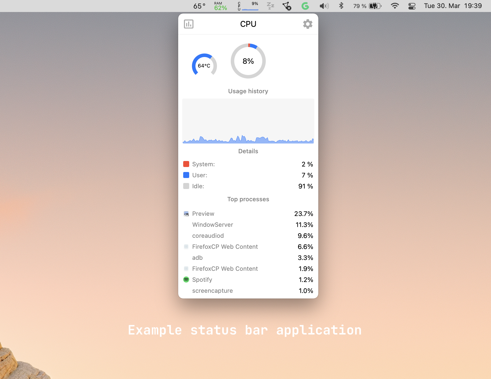

So far we have toiled away on the JavaScript side of things, but we are now going to go a little deeper into creating custom functionality that interacts with the underlying OS.

But before we start writing code, we need to clarify some concepts - mainly how React Native works under the hood, and how it communicates with native code and modules.

### React Native and native UI

At the start of the course we said that React Native works by translating your React components into native UI components, thereby achieving greater performance than web alternatives.

Although this is true, this is a high-level abstraction, so a more concrete definition is that React works with its own set of native components (usually prefixed with RCT). A brand-new React Native project will work within a `RCTRootView`, and this view contains your entire app.

However this view is just another iOS/macOS view, and it can be embedded within other native views and existing apps. As a matter of fact, large apps already do this, for example, Instagram embeds React Native views in several parts of their apps (mostly the non-performance critical parts). These type of apps are called `brownfield` apps.

### The React Native bridge

Now that explains how your React components are translated into the native layer, but there is one more mechanism we need to pay attention to - the React Native bridge.

The bridge is a translation layer between your JavaScript code and the underlying native languages of the platform, taking your JavaScript invocations, serializing them into JSON and then passing them to native code.  This serialization is one of the weak points of React Native, and with large enough payloads a lot of processing power is wasted serializing and de-serializing messages between JavaScript and the OS.

However, the bridge allows us to easily connect to the lower levels of our app, that is, to expose native functionality to our JavaScript code.  We will learn how to create our own native methods and call them from our high-level JavaScript code.

:::notes
This is a slide from a great presentation given by [Lorenzo](https://twitter.com/kelset)
:::

There is one more thing which is worth mentioning here. React Native recently announced new bindings for native functionality that do not go over the bridge. The documentation is sparse and it is still not officially supported, so we are not going to cover it, but there are a few [repos](https://github.com/craftzdog/react-native-quick-base64) out there to look at if you need to squeeze every inch of performance out of React Native.

### Turning our app into a menu bar app

In the next lessons we are going to start with a cool proof of concept - we are going to turn our app into a menu bar app. Basically we will embed our root React Native view into a macOS popover, so the user always has access to their favorites. We will see how to manipulate the native views and create our own native API.

