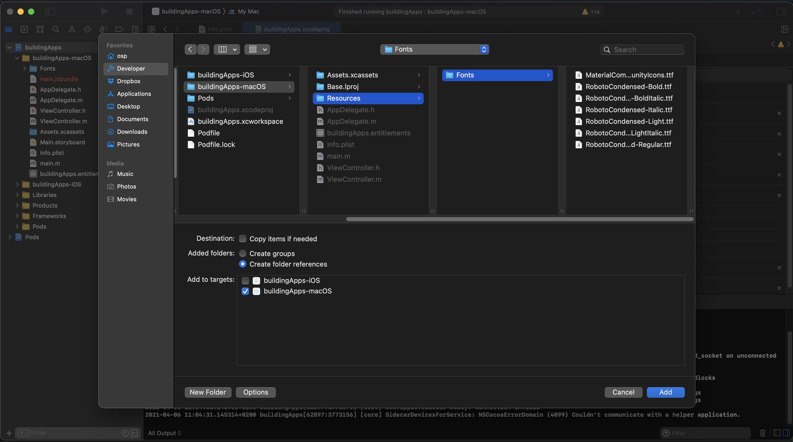
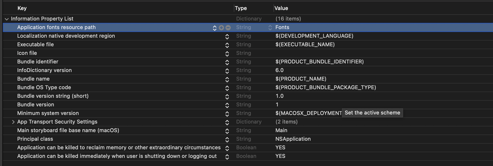
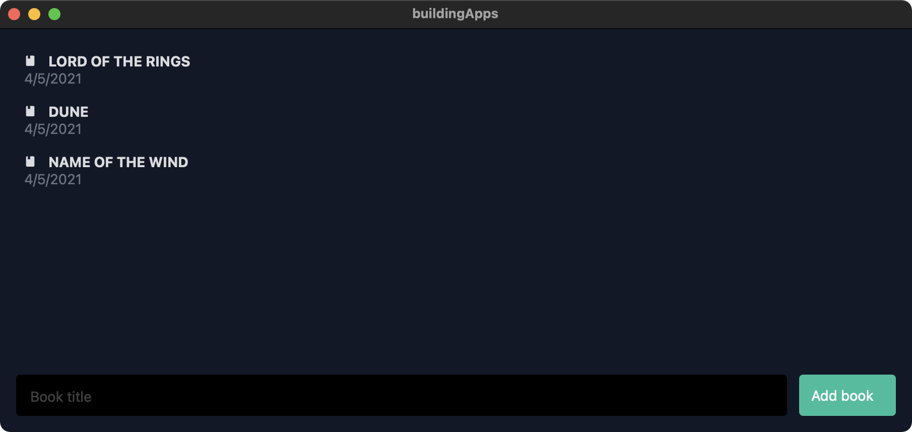
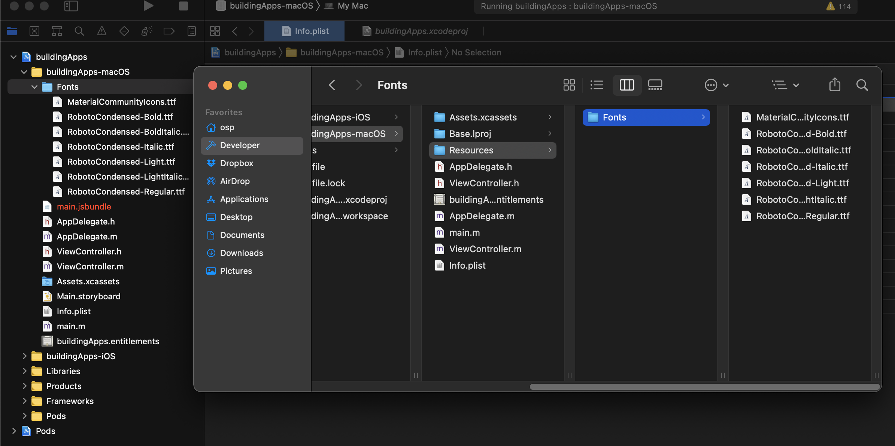

No app nowadays is complete without iconography. In order to add icons to our app we will use [react-native-vector-icons](https://github.com/oblador/react-native-vector-icons).

If you just want to integrate the icons, the instructions on the README are quite straightforward, however, if you also want to integrate other fonts in your app it gets a little bit more complicated.

## The easy way of adding icons

The react-native-vector icons README illustrates a simple way to [add the fonts to a macOS](https://github.com/oblador/react-native-vector-icons#osx-via-react-native-desktop) app, once you have added the dependency you can just follow the instructions.

Browse to node_modules/react-native-vector-icons and drag the folder Fonts to your project in XCode. Make sure your app is checked under "Add to targets" and that "Create folder references" is checked.

Edit `Info.plist` and add a property called "Application fonts resource path" (or ATSApplicationFontsPath if XCode won't autocomplete, or you're not using XCode) and type "Fonts" as the value.

The problem with this approach is that we can only link one folder for your font files, and that means that once we follow this approach (symbolic linking directly to the node_modules folder) then we won't be able to add other custom fonts to our app. Therefore we will manually create the folders and individually link our fonts.


#### 1. Add the vector icons dependency

Let's start by adding the vector icons dependency to our project:

```bash
yarn add react-native-vector-icons
```

This package does not come with integrated type definitions, so we will install them separately:

```bash
yarn add --dev @types/react-native-vector-icons
```

#### 2. Open the .xcworkspace in Xcode

We are going to open the `.xcworkspace` file from the `macos` folder in XCode (you can just double-click it). The .xcworkspace is a wrapper for our app's XCode project but it also adds all the Cocoapods dependencies.


#### 3. Create the necessary folders and files

In your terminal (or in Finder), navigate to your app root folder and then to the `macos` folder, and once inside, go to the `[project name]-macOS` folder, and there create a `Fonts` folder. Inside that you are going to put all your font files. We will start by copying the vector-icons fonts.

Copy the font files via Finder -  on the root of the folder navigate to the `node_modules/react-native-vector-icons/Fonts` folder, then copy and paste all the files inside of that folder into our `macos/[project_name]-macos/Fonts` folder. You could also do this via the command line, with something similar to this:

```bash
# If you are already in the /macos/[project_name]-macos/Fonts folder
cp ../../../../node_modules/react-native-vector-icons/Fonts/* .
```

#### 4. Add the references inside XCode

Now, inside XCode on the project explorer (left sidebar), right-click on the `macos` folder and select the `Add files to ...` option. A new window will open in which you can select the Fonts folder we created, making sure to *de-select* the "Copy items if needed" option and *select* the "Create folder references" toggle. This will create a symbolic link to our folder instead of creating a copy.



#### 5. Change the info.plist file

Still inside XCode, locate the `info.plist` file; this file contains high-level configurations for our app. Once you open it, add a property to the list (small + button on the first item). For the property name you need to input `Application fonts resource path`. The value for this entry needs to be `Fonts`.



:::important
On iOS you can point to individual font files, but in macOS apps you can only have a single folder that contains all the fonts.
:::

#### 6. Recompile the app

We should now recompile the app (on the terminal `yarn macos`), so that our fonts get packaged. Let's update our Books component so that it now uses icons:

```tsx
// src/containers/Books.container.tsx

// Other imports come here
// Add the following import
import Icon from 'react-native-vector-icons/MaterialCommunityIcons';


// ... later when we iterate on the list
{root.ui.uppercassedBooks.map((book) => (
  <TouchableOpacity
    key={book.title}
    onPress={() => navigation.navigate('Book', {title: book})}>
    <View style={tw('p-2')}>
      {/* We can use our icon here*/}
      <View style={tw('flex-row items-center')}>
        <Icon name="book" />
        <Text style={tw('font-bold ml-3')}>{book.title}</Text>
      </View>
      <Text style={tw('text-gray-500')}>
        {book.date.toLocaleDateString()}
      </Text>
    </View>
  </TouchableOpacity>
))}
```

We first import the `Icon` component, and you need to specify from which sub-package of icons you want to import it from - react-native-vector-icons comes with many. In my version of the app I only linked the `MaterialCommunityIcons` font, so I will use that one. 

Later in the main body of the function, we slightly modify the rendering of the book items, so it will now contain a small icon to the left of the name. If everything has been done correctly you should be able to see a small book icon.



## Adding custom fonts

Now that we have taken care of the hardest part of the app (creating the folders and internal XCode references), adding custom fonts is easier. Download your custom font (`.ttf` file) from any source you like, then put them in the `Fonts` folder. Since XCode already a reference to it, there is no need to re-import it, you only need to re-compile your app.

For example, I have added the Roboto font to my project:



Later if you want to use it in your project, you only need to add the `fontFamily` property with the font family name:

```tsx
// Change the font family of the book title on the books component
<Text style={[tw('font-bold ml-3'), {fontFamily: 'Roboto Condensed'}]}>{book.title}</Text>
```

