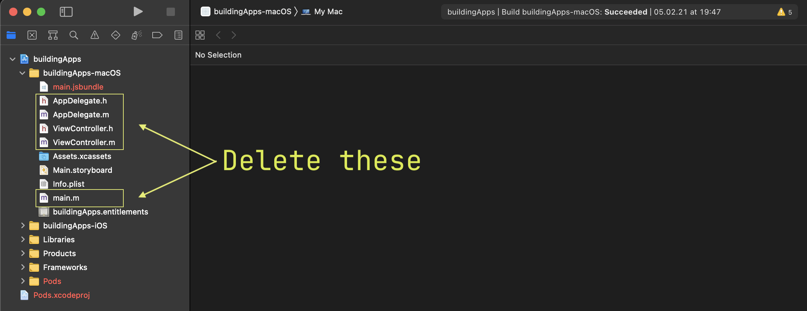
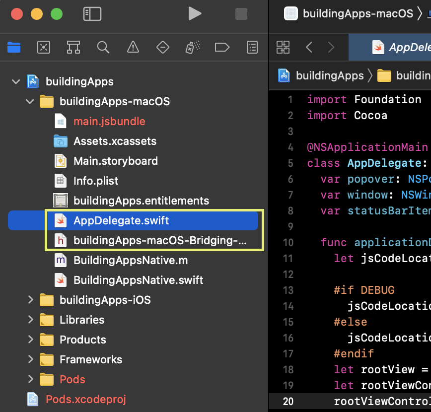
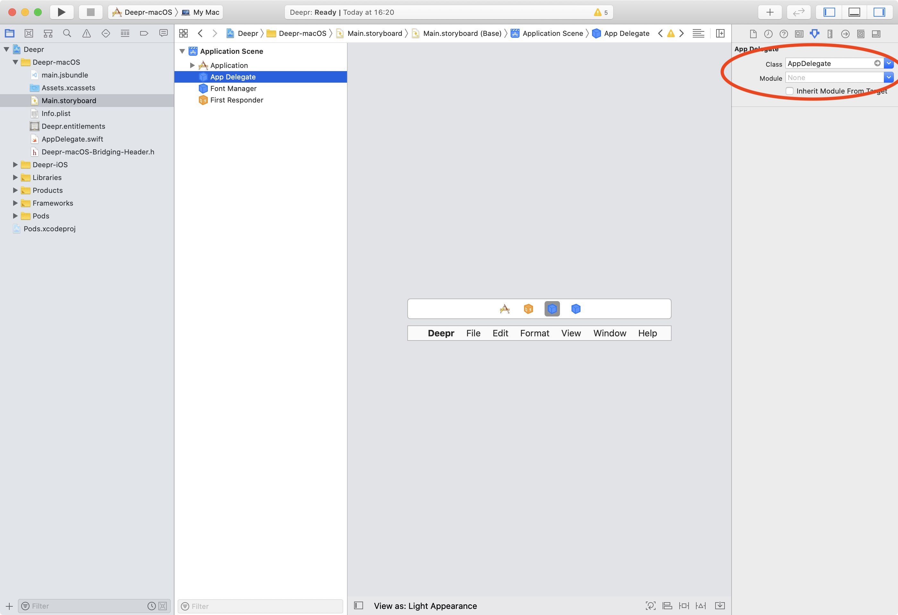
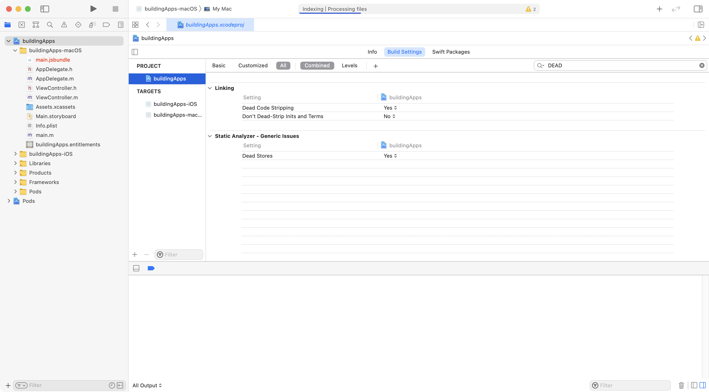
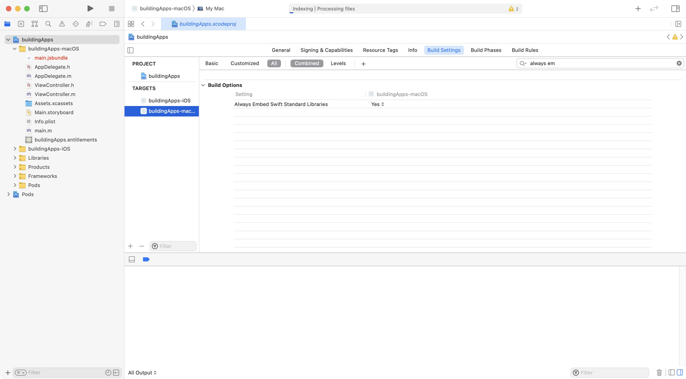
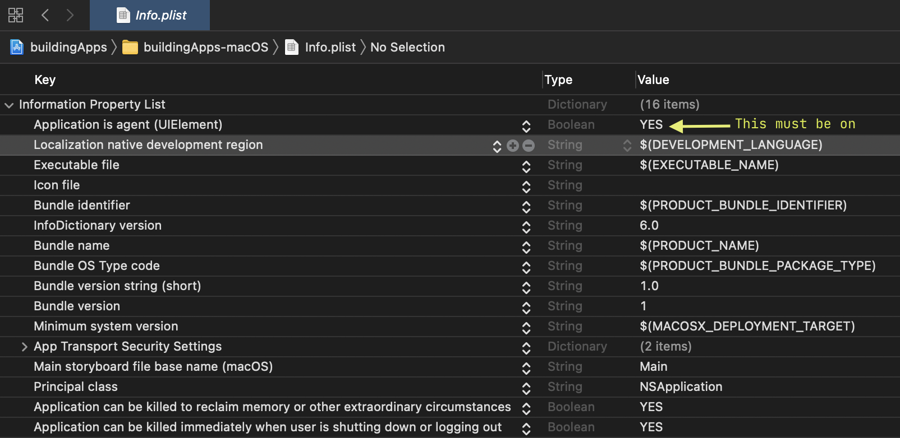

Now, we are going to turn our app into a status bar app. To do this we are going to migrate the native code from Objective-C to Swift.  In all honesty, this is not 100% necessary - we could do this **without** Swift, but... I don't know Objective-C and I also don't want to learn it! It has very complicated syntax, and outside mac native development there is very little use for it.

When I started developing my apps on macOS I knew very little Swift, but it's much more similar to JavaScript and C-like languages than Objective-C, so it makes sense to migrate our base app to Swift.

### Migrating to Swift

There are quite a few steps here, so I'm going to be as thorough as possible.

#### 1. Remove the existing Obj-C code

Delete the following files from the project

```
AppDelegate.h
AppDelegate.m
main.m
ViewController.h
ViewController.m
```
You have to delete them from XCode to remove the internal references, otherwise your project might be left in a broken state.



#### 2. Create a AppDelegate.swift file

In your project's `-macos` folder, right-click and select *create new file*, then select Swift and create an `AppDelegate.swift` file.

Once you create it, XCode will ask if you want to create a bridging header file. Accept the prompt. The bridging header file will expose Obj-C libraries to our Swift code, a requirement if you write any Swift in an XCode project.



The bridging header simply allows exposing Obj-c libraries to Swift - within this bridging header add the following content:

{lang=objc,line-numbers=on}
<<[macos/buildingApps-macOS/buildingApps-macOS-Bridging-Header.h](./protected/macos/buildingApps-macOS/buildingApps-macOS-Bridging-Header.h)

and in `AppDelegate` you can replace the following content (we will walk through it next):

{lang=swift,engine=treesitter}
<<[macos/buildingApps-macOS/AppDelegate.swift](./protected/macos/buildingApps-macOS/AppDelegate.swift)

- First and most obviously, we are getting rid of Obj-C and replacing it with a single Swift class `AppDelegate`.  This class is required to start any macOS app. The class extends certain classes and therefore needs to implement certain functions, however it's beyond our scope to understand every detail of the macOS toolchain, so let's limit ourselves to using this class as-is for now.

- There are a couple of extra properties in the class, namely a `popover` variable and a `statusBarItem`.  The popover is a view, much like other popups you may be familiar with, that can hold any view you pass to it. We will use it to hold our React Native view.  The status bar item is just that, a status bar item.  There is also a NSWindow, we will use it as a "development" window.

- The next part of the code is the same as the Obj-C counterpart - we initialize the `RCTRootView` which is the base view of our entire React Native app, and embed it within a `NSViewController` that we will later use as the controller for our remaining views.

- Next there is some initialization code for the popover and status bar item elements. To control our popover we have added an additional `togglePopover` function, that does just that - whenever it is called, it will either show or hide our app.

- You will see this funny syntax `#if DEBUG` - this is a pre-processor directive. The code inside it is going to be pre-processed **before** compilation, if the `DEBUG` flag is set (this is automatically done on Obj-C but we will also do it for Swift).  Then it either inserts or removes the code inside the if block, into the final compiled code.  We have used this mechanism to create a dev window (React Native also uses it to initialize the bridge in dev mode). The reason for it is that if you were to try to develop your app with only a popover, it would automatically close, and you would have to constantly click it to see your changes, so we just save a lot of time by doing this.

- You will notice that our popover and the window share the same controller, but as you will see when we run the app, this doesn't mean that you will have two instances of your app. Once the popover opens, the window will lose hold of the controller and our app will only be rendered in the popover, but since we are using it for development, this is fine.

- One final thing to notice is that in the code above, the `RCTRootView` is initialized with the name of my project, but it should **match the name of _your_ project** (the name used to register the app in the root folder `index.js`).

#### 3. Cleaning up old UI references

Before we can hit run, we need to take care of a few other things. On the XCode sidebar, click on the `Main.storyboard` file, and now on the right-hand side you will see a selectable field for AppDelegate.  Since we deleted our old AppDelegate, you need to select this delegate one more time. Also delete the old references to the View Controller and the Window (on the left explorer panel).




#### 4. Setting up correct build settings

If you were to hit run right now, you would get a mysterious Swift linking error, as it turns out that flipper support does weird things to a Swift project. So, we are going to head to our project build settings (select the root folder in the file explorer and then select the macOS target, then go to the build settings tab). In there you are going to search for `DEAD_CODE_STRIPPING` and set it to `YES`. Next search for `Always embed swift libraries` to `YES`.




			
We are also going to set up the correct `DEBUG` flag we mentioned earlier, so again in the build settings, search for `Other swift flags` on the macOS target. If you click on the value you should see a list of set flags. Add a new one and type `-DDEBUG` (the first `D` is not a typo) **under the debug configuration** only.

:::important
There is a small error in the video, I set the -DDEBUG flag for all the versions, release and debug, want you want to do is expand the item and add the -DDEBUG flag only for debug mode, otherwise when you release your app to your users, it will try to connect to the metro packager
:::

#### 5. Success!

And we are good to go! If everything has been set up correctly, you should now be able to hit run (or CMD + R) and our app should run inside of a status bar element! Pretty cool right?! 🎉


#### P.S. turn on "Application is agent" (UIElement) flag

If you really want to make your app behave like a status bar item, then you want to make it not "alt-tabable". To do that, edit your project's `info.plist` file (in the file explorer) and start typing "Application is agent" (it will autocomplete for you; the internal flag name is "UIElement"). Set the value to `YES` and it will hide your app from the running apps selector.

