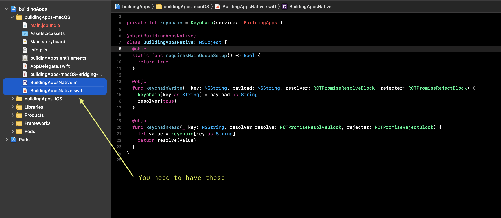

Now that we have seen a bit of the internals of React Native and how to manipulate the root container, our next step is to expose native functionality to our JavaScript code. A good case to learn this with is adding persistence to our app. 

React Native has some built-in persistence mechanisms, but we will take it a step further by storing our app's data in the macOS keychain, to ensure that no other app can access it.

This and the following lessons will be the most detailed in the course, and a lot of the functionality we will add into our app will pivot on this knowledge, so pay attention!

### About the React Native bridge

We've briefly mentioned the React Native bridge before, but it's now time to expand on this. The bridge allows our JavaScript code to communicate with native code. We will create our very own private API to call native functionality from our JavaScript. React Native provides certain macros that auto-generate code and will create JavaScript-callable bindings.

### Adding keychain framework

We will start by adding a native dependency to write data to the macOS keychain. We will modify our project's `Podfile`, by adding [Keychain Access](https://github.com/kishikawakatsumi/KeychainAccess) as a dependency to allow us to write and read from the keychain. A quick look at the README should give you an idea of how to use its API.

{lang=ruby,line-numbers=on,crop-start-line=4,crop-end-line=19}
<<[macos/Podfile](./protected/macos/Podfile)

Add the `pod 'KeychainAccess'` line, then in your terminal run `yarn macos:install` and you will see CocoaPods installing our new native dependency.

### Creating the bridging code

We will create a new Obj-C file (in XCode, file explorer -> right click -> new file). Give it the same name as our project, with a "native" suffix `.m` to make it clear it is our own native code module we are running, e.g. `buildingAppsNative.m`. Add the following content:

{lang=objective-c}
<<[macos/buildingApps-macOS/BuildingAppsNative.m](./protected/macos/buildingApps-macOS/BuildingAppsNative.m)

Let's go through the file. 

First we import the `RCTBridgeModule` which will contain all the macros to expand our code.

Then `RCT_EXTERN_MODULE` will be expanded. The first parameter is the name of the custom class where our code will live (we will create it in a moment) and the second parameter is the base class which will be extended, which you can ignore for now.

Next,  you can see we have created two "external" methods. The syntax here is a bit cumbersome, but the first token, eg `keychainWrite`, will be the name of the method that not only will be exposed but also needs to match the native function name. Then comes the type of the first parameter, in brackets, and then the parameter name, and then an alias, before the colon which separates the parameters.  

### Writing the Swift code

Now that we have the bridging code, we need to actually write our functions. Since we will do it in Swift we need to expose the bridging module to the Swift code. We will modify the Swift bridging header (don't mix it up with the React Native one), by adding the `React/RCTBridgeModule`:

{lang=objective-c,crop-start-line=1,crop-end-line=1}
<<[macos/buildingApps-macOS/buildingApps-macOS-Bridging-Header.h](./protected/macos/buildingApps-macOS/buildingApps-macOS-Bridging-Header.h)

Afterwards create a Swift file with the same name as the Obj-C file we created before, in our case `BuildingAppsNative.swift`:

{lang=swift,engine=treesitter}
<<[macos/buildingApps-macOS/BuildingAppsNative.swift](./protected/macos/buildingApps-macOS/BuildingAppsNative.swift)

- At the top you will see we have imported our `KeychainAccess` dependency, which we then create an instance of to use throughout our module.

- Then we'll create our bridged object - maybe you have noticed the `@objc` decorator on previous lessons? This decorator creates bindings from Swift code to Obj-C code. Since the bridge was created for Obj-C, there is a bit of a workaround to allow the bridge code to interact with Swift code.

- In the body of our class, there is a `requiredMainQueueSetup` method - this is just internal code to tell React Native to initialize our code in the main app thread. We will talk about threads later.

- Now we reach the important part of our native bindings - we can implement the two functions we created on the bridging module. Bear in mind that the names of the functions and the parameters need to match. As you see we are dealing with promises here (`RCTPromiseResolveBlock` and `RCTPromiseRejectBlock`) which will allow us to resolve or reject values for JavaScript promises.

If you were to hit compile right now, our app would compile just fine - but -  how do we call our newly-minted API from JavaScript? 

We will look at that in the next lesson.