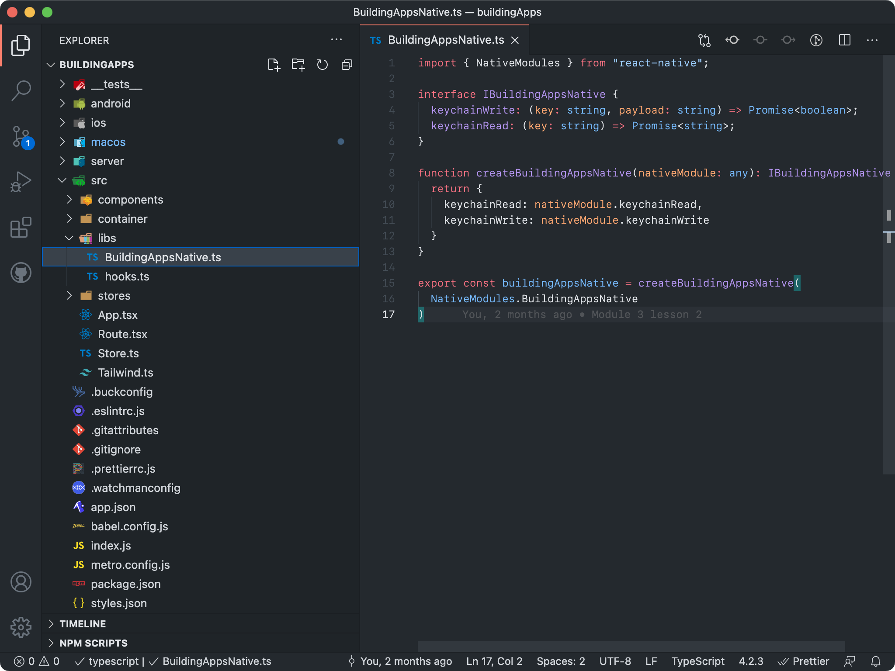

We have now created all the native code to expose new functionality to our JavaScript code, so it should only be a matter of calling it, right? Well, yes...... but we are going to be a little smarter about it. Just because the native code has been created does not mean our code is type-safe by default - remember, the bridge simply serializes/deserializes everything into JSON.

So we are going to create a small wrapper for our native code, create a `BuildingAppsNative.ts` file inside of a new `libs` folder:



{lang=typescript}
<<[src/libs/BuildingAppsNative.ts](./protected/src/libs/BuildingAppsNative.ts)

Basically, React Native exposes our created module *inside* of the `NativeModules`. We are just going to provide a type-safe wrapper. Here you could also disable the methods if you have certain specific functionality that won't work on other platforms (iOS or android).

```ts
import { Platform } from 'react-native';

...
keychainRead: Platform.OS === 'macos'? nativeModule.keychainRead : () => null,
...
```

After we have created our wrapper we can use it. Since we are interested in saving our state, we are going to enhance our UI store a bit, so after importing our native module, we will add a couple of functions:

{lang=typescript,crop-start-line=1,crop-end-line=1}
<<[src/stores/UI.store.ts](./protected/src/stores/UI.store.ts)

{lang=typescript,crop-query=.persist}
<<[src/stores/UI.store.ts](./protected/src/stores/UI.store.ts)

The persist function is fairly straightforward, except for a small but important detail. The `toJS` method recursively traverses our store and returns a plain JS object. Let's take a small detour and explain why. MobX observables are a bit magical - the moment you access them inside of a function, this function gets registered as depending on that observable. If the observable changes then all the functions that are observing it will re-run, at least as long as they are registered in auto-run wrapper. The `observer` wrapper that we applied to our Books container is simply doing this for us, but we can also do this manually.

With that knowledge, it is clearer why we should use `toJS` rather than a JSON.stringify method; since `toJS` is recursive, it will touch *all the hierarchy* on the observable you pass to it. This means that even if there is a deep-nested change in the observables, it will still trigger a persist call. With that simple trick we are now subscribing to *any* change in our store.

{lang=typescript,crop-query=.hydrate}
<<[src/stores/UI.store.ts](./protected/src/stores/UI.store.ts)

The hydrate function is also fairly straightforward: fetch the serialized state from the keychain and turn it into a JavaScript object again (pay attention to the `runInAction` since we have an `await` at the top of the function).

Now at the bottom of the `createUIStore` function, before returning the store instance to the caller, we can hydrate and then auto-persist our store. As mentioned we can register our functions as observables, and to do this for any function (not just components), you can use the `autorun` wrapper:

{lang=typescript,crop-start-line=101,crop-end-line=103}
<<[src/stores/UI.store.ts](./protected/src/stores/UI.store.ts)

We can now finally compile and run our app (remember `yarn macos` as we need a full compilation). When the app starts you will see a keychain prompt, which means our code is correctly trying to access the keychain. We can now shut off our sample server (you kept it running right?) and when our app starts, the persisted data should be loaded one more time!