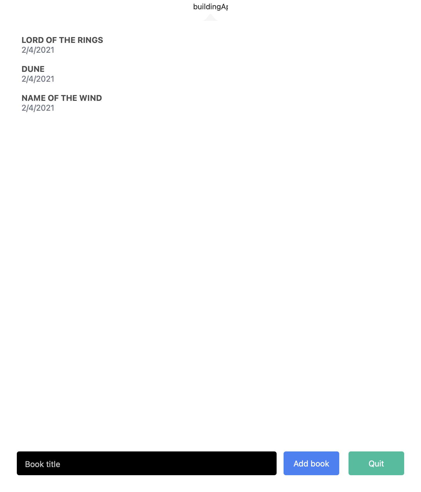
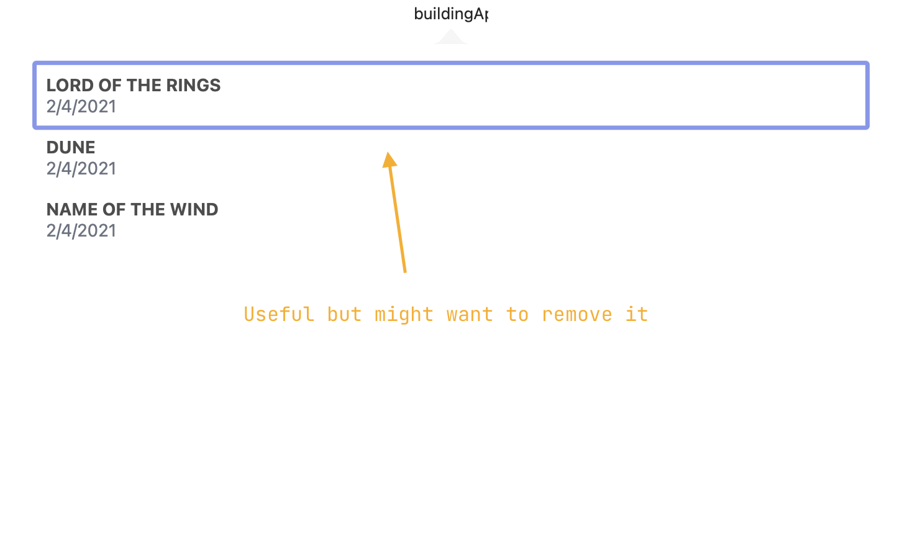

There are other things that make the Desktop experience different from mobiles. Namely, we need to give more feedback to the user whenever the mouse is used or some UI element is highlighted.

### Adding hover states

As you develop your app, you will realize that React-Native-macOS still has some way to go in providing all the APIs you will need. Unfortunately hover states is one of those cases.

We will start by using an undocumented API (as of this writing) to add hover states to our buttons. Let's start by creating a new `components` folder in the `src` directory and then creating a `Button` component:

{lang=typescript,line-numbers=on}
<<[src/components/Button.component.tsx](./protected/src/components/Button.component.tsx)

Let's quickly go over the component.  First we create the interface for our button. Since we pretty much want to maintain the behavior of all the buttons in the app, there is no need for us to re-invent the wheel here - we can just re-use the `TouchableOpacityProps` types provided by React Native. We added two extra props however: a `title` string and a `style` object.

We can now declare our function component. We decompose the props to extract the two props we manually added, and the rest of the props we can leave as `...props`. This means the rest of the props that were passed to the component (which should match `TouchableOpacityProps`) will be crammed in a single `props` variable.

We can then add a `useState` to keep track of if our component is currently hovered (the mouse pointer is on top of it). Then we declare a dynamic color based on the hover state.

We can now move to creating the UI for the button. Everything should be familiar for now, the important part however is that we have added the props `onMouseEnter` and `onMouseLeave` to the `TouchableOpacity` component. The function you pass to `onMouseEnter` will trigger whenever the mouse pointer enters the area of the button. The function you pass to `onMouseLeave` will do the opposite. This effectively triggers when the mouse hovers our button, but there is a limitation. React Native does not correctly prevent the event from bubbling up, so you might notice that if you layer other elements on top, our button will still trigger the hover function. Since this API is not documented or properly typed we will also need to suppress any TypeScript errors by using the `// @ts-ignore` annotation.



### Focus rings

If we replace this component in our Books container, you should be able to see the hover state being triggered. If we click on it however, you will also see there is a focus ring around our button. This is part of the OS as an accessibility feature which some people dislike - although we must remember to consider the value of accessibility features for some of our consumers! We will use another undocumented API to remove this ring.



```tsx
<TouchableOpacity 
  {...props}
  // @ts-ignore
  enableFocusRing={false}
  // @ts-ignore
  onMouseEnter={() => setIsHovered(true)}
  onMouseLeave={() => setIsHovered(false)}
>
```

As you build your app, you will run into these limitations. As React-Native-macOS matures, I expect many more things to be patched and fixed, however right now the best solution for certain issues is to go into the [react-native-macos repository](https://github.com/microsoft/react-native-macos/issues). The maintainers are currently very active and answer a lot of questions.