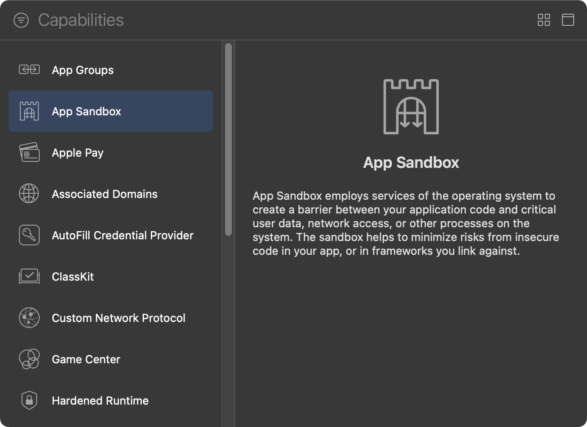
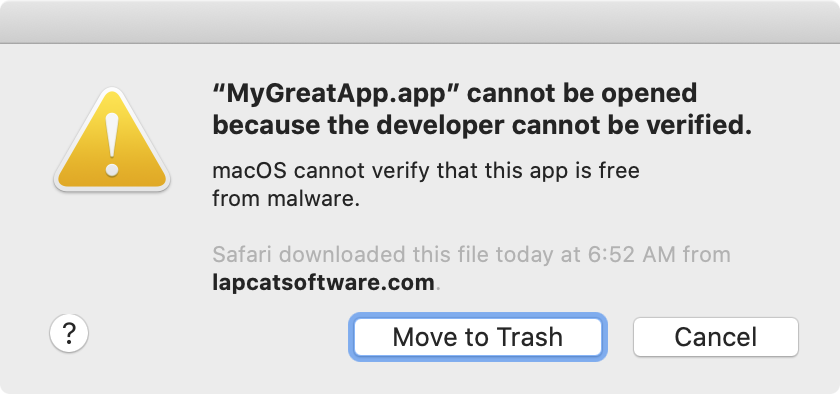
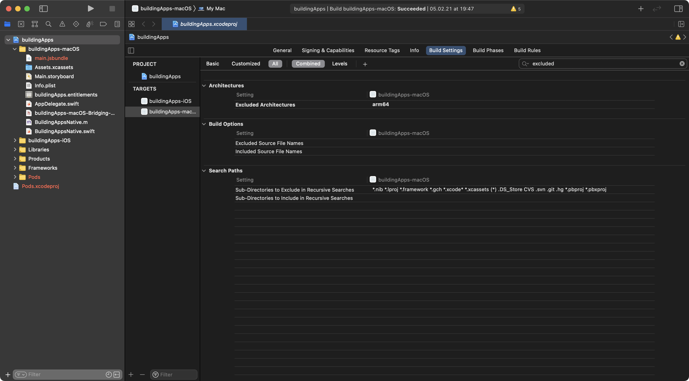

We are now ready to release our app to the masses, and there are some important points to discuss. 

If you plan to distribute your app via the Apple App Store, the requirements will be very similar to those of any iOS app. However, unlike the mobile counterparts, you are not forced to release your app via the App store - although Apple does not make it easy.

### Releasing via the App Store

Releasing via the App Store has some upsides -  for example, you don't need to worry about updating your app, or hosting. Apple takes care of this by automatically updating the app once you release a new version, however their draconian purchase scheme still applies. You cannot offer in-app purchases without paying them their 30% ransom. We'll take a look at what is required to release the app on your own in a moment, but for now let's say we want to release our app into the App Store. What would we need to do?

First and foremost you will need an Apple developer account ($99/year). 

There are certain things that App Store apps are not allowed to do, for example, anything that messes with the kernel or lower layers of the OS is going to be quickly flagged and rejected. 

Unlike iOS apps, macOS apps are not sandboxed by default, so in order to distribute them via the App Store you need to turn sandboxing on. You can do this by going to your project macOS target's settings -> `Settings & Capabilities` -> `Sandboxing`. After you have added it you will see a list of things your sandboxed app will need permission to do, and since we are doing outgoing HTTP requests, you need to tick the `Outgoing Connections (Client)` option.

There are other smaller flags and configs you will need to take care of, for example setting an app category (Target settings -> `General` tab), however XCode and the App Store upload process will guide you through any missing config. It's important to note that if you want to use a continuous integration provider to build a delivery pipeline for your React-Native-MacOS app, most providers don't support macOS (or Windows) as compilation targets right now, so you might need to create a manual workflow.

### Releasing your app outside the App Store

If you don't want to pay the Apple ransom money, how would you go about releasing your app? Well, it is possible! When you compile your app, you can just generate your own certificates and distribute your app as-is, however since the Catalina release, Apple has a very hostile message to users trying to run your app.

You will have to instruct your users to go to the OS system settings panel -> `Security` -> `Allow open`. This is a poor experience and is just a way for Apple to wall their garden even more, however this is the free option.

The other option is paying for the developer account but not distributing your app via the App Store. Users will just be able to download it and open it without any scary warnings. Once you have your developer account set up, when you export your app (`Menu bar` -> `Product` -> `Archive`), you can select the `Developer ID` option and that's it.

It's important to remember that if you are distributing outside of the App Store, you need to take care of updates (and hosting the binaries) yourself. The most common way to do this for years has been [Sparkle](https://sparkle-project.org). The set-up is a bit confusing, but it works fine (for Sparkle to work you need to remove the sandboxing attribute from the macOS target in XCode - Sparkle will support sandboxing in the future). You can just add it as a dependency in your Podfile (and maybe create a native binding so your users can check for updates manually).

If you do end up using Sparkle, you have to guarantee the integrity of your updates. Sparkle does also work with Apple Code Signing and it makes it easier to verify your app bundles, so it might be worth keeping the developer account going.

### Apple silicon

There is one small but important point left to mention. As at the time of this course's creation, Apple has released their shiny new macs with their own ARM processors. Unfortunately it seems like React-Native-macOS is not quite ready to support the new architecture. When developing my apps I got a slew of mysterious errors (Hermes definitely does not support it yet).

If you face any issues during compilation, you might need to compile the app only for the Intel architecture (x86_64) for now (it will still run via Rosetta2). In order to do this you need to go to your macOS target build settings, search for `Excluded Architectures`, and add `arm64`.

Support will more than likely be added with time, so just check if your app compiles without this setting. If it does you might not need to do anything else.

### That's it! (for the basic stuff)

We have now completed the bare minimum for a "working" macOS app. Together with your knowledge from the previous lessons you should now be able to create a fully functioning macOS app, that is faster that most web alternatives. You will also have learned how to create your own native APIs to access the underlying OS functionality.

However our course is not done yet! We missed some minor stuff like setting up app icons, because the process is the same for React Native developers and native macOS developers, and there are many resources out there. In our final module we will cover advanced macOS functionality and how to use it to create a truly superb desktop experience for your users.
