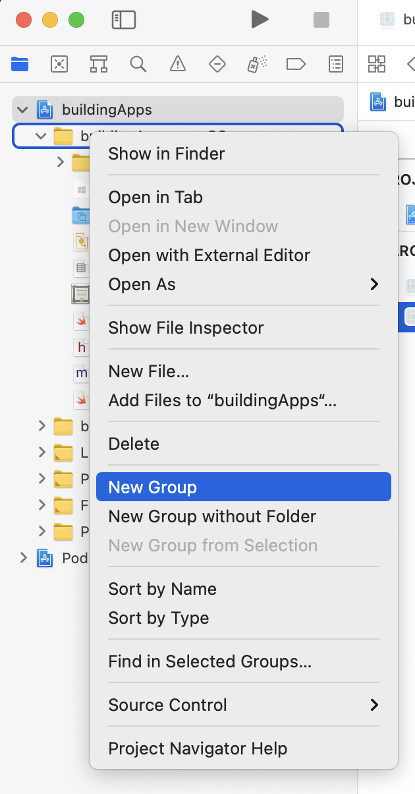
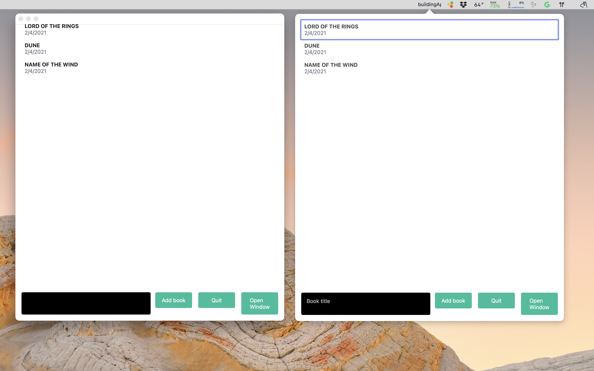

Unlike in mobile apps, with desktop apps you are dealing with windows. Your web browser can have multiple windows, the file explorer can have multiple windows and your terminal can have multiple windows. It's what you expect of a desktop app.

So, we are going to add multiple window support to our app, but we are going to be a bit smart about this. We have talked about the bridge quite a bit over this course, and we are going re-use a single instance of our bridge to drive multiple windows. This might not be 100% necessary (you could drive multiple windows with separate bridges), but it will be a nice exercise to get to know the native side of things a bit better.

#### Abstracting the bridge

So we will start by doing a refactoring in `AppDelegate`. We can create an instance of the bridge on the `applicationDidFinishLaunching` method, but this can quickly become complex to read, so, start by creating a `lib` folder **in XCode** within our macOS project (from some reason Apple calls them "Groups").

Inside create two new Swift files: a `ReactViewController.swift` and a `ReactNativeBridge.swift`.

{lang=swift,engine=treesitter}
<<[macos/buildingApps-macOS/lib/ReactViewController.swift](./protected/macos/buildingApps-macOS/lib/ReactViewController.swift)

The `ReactViewController` will wrap our root `RCTView`, so we don't have to manually instantiate a controller.

{lang=swift,engine=treesitter}
<<[macos/buildingApps-macOS/lib/ReactViewController.swift](./protected/macos/buildingApps-macOS/lib/ReactNativeBridge.swift)

This `ReactNativeBridgeDelegate` and its companion `ReactNativeBridgeDelegate` are another wrapper for initializing the React-Native bridge. It will make it easier for us to re-use the bridge for multiple views.

We can now head to our `AppDelegate.swift` file and use our new classes. Start by adding a new instance value for our bridge along with a variable to hold a new window instance:

{lang=swift,engine=treesitter,crop-start-line=10,crop-end-line=11}
<<[macos/buildingApps-macOS/AppDelegate.swift](./protected/macos/buildingApps-macOS/AppDelegate.swift)

You can see this time the window variable has a `?` character appended, that is because we will create it at a later point in our app's lifetime, therefore we need to declare it as optional. 

Replace the initialization code for the popover controller:

{lang=swift,engine=treesitter,crop-start-line=15,crop-end-line=20}
<<[macos/buildingApps-macOS/AppDelegate.swift](./protected/macos/buildingApps-macOS/AppDelegate.swift)

We can now create a new function that will take care of initializing a new window **and** creating a new controller for this window:

{lang=swift,engine=treesitter,crop-start-line=71,crop-end-line=93}
<<[macos/buildingApps-macOS/AppDelegate.swift](./protected/macos/buildingApps-macOS/AppDelegate.swift)

The code is pretty straightforward. If the window variable has not been created, we initialize a new `NSWindow` object. If the window variable has been created then just move it above the other windows. There is however one important detail to notice -  pay attention to the `moduleName` parameter when we create the `ReactViewController`. We have added a `-window` suffix to the name of our module which will allow us to register a "new" React Native app whilst allowing the app running on the popover to run independently.

### Initializing a new app bundle

We are almost there, and can now create our native binding to call this method. By this point you should be very familiar with this! Create the bridging binding:

{lang=objective-c,crop-start-line=11,crop-end-line=11}
<<[macos/buildingApps-macOS/BuildingAppsNative.m](./protected/macos/buildingApps-macOS/BuildingAppsNative.m)

Add the actual Swift implementation:

{lang=objective-c,crop-start-line=33,crop-end-line=39}
<<[macos/buildingApps-macOS/BuildingAppsNative.swift](./protected/macos/buildingApps-macOS/BuildingAppsNative.swift)

And finally add it to our JavaScript native module class (BuildingAppsNative.ts):

{lang=typescript,crop-query=.openDesktopWindow}
<<[src/libs/BuildingAppsNative.ts](./protected/src/libs/BuildingAppsNative.ts)

Afterwards you can add a button on your UI to just call it, however there is one more thing we need to do. Remember we added the second controller with a different module name (`-window` suffix)? We need to register this module with React Native so it loads it in the correct window/controller. We will register it in `index.js`.

{lang=javascript}
<<[index,js](./protected/index.js)

You can see we are registering our same app, but we could just as easily export a slightly different version of our app, maybe with different navigation or different styles, better suited for responsive windows. However the really cool part is that this is all done within the same bundle. You already have all the functionality you have developed before (including any mobile code!) Cool, huh?!

Unlike the dev window we created at the beginning of the course, you will see that both our popover and the new window we have created can exist at the same time.

There is one more detail to note. Since we registered our app as a `UIElement` (that is, it is not alt-tabable), users won't be able to switch into this new window so easily, so you might want to disable/remove the `UIElement` flag, before distributing your app.