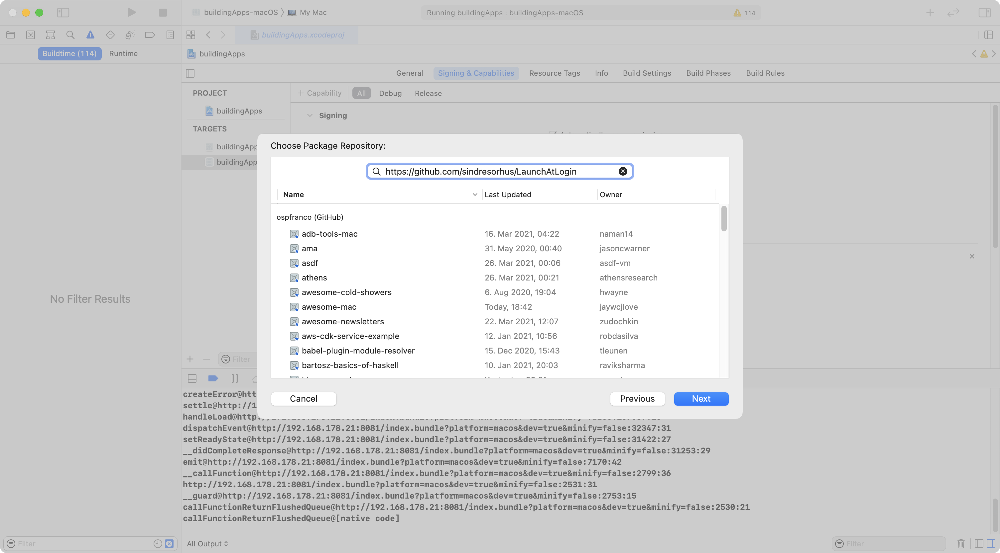
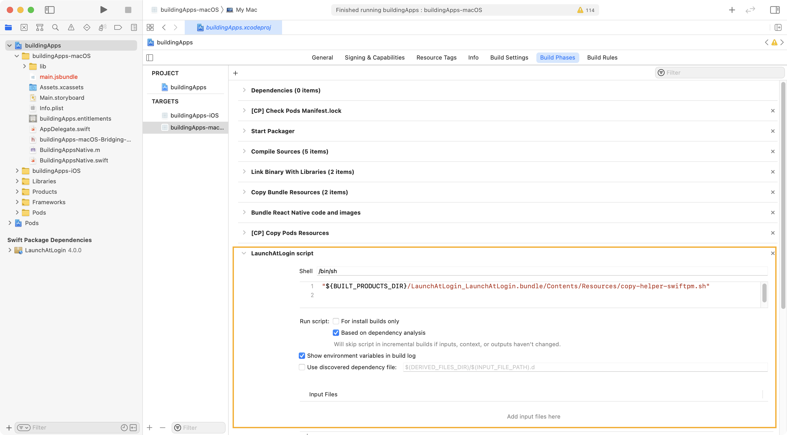
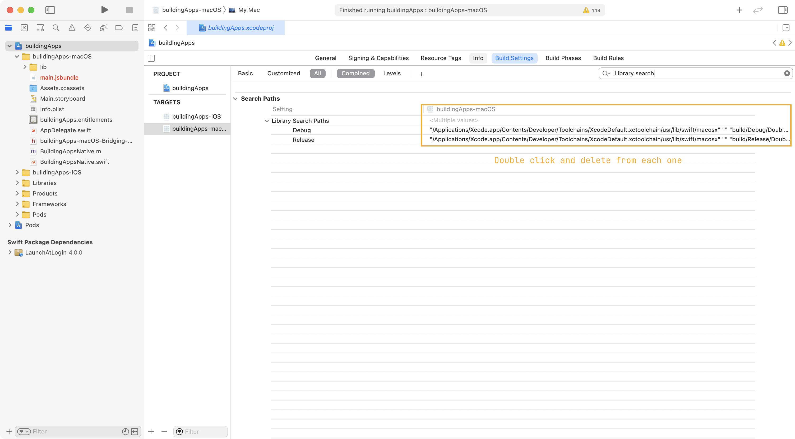
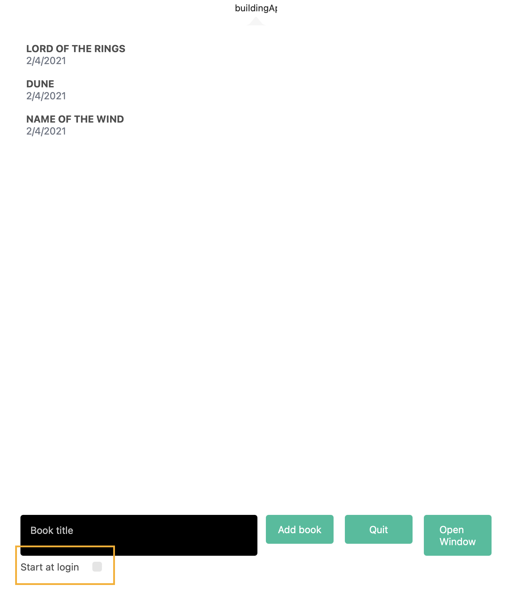

Again, one of the main differences between mobile devices and your computer is that your computer is designed to run multiple programs at the same time. Since we have developed a menu bar app, you would expect to have an option to launch your app as soon as you log into your computer.

Doing this manually is a [very long, error prone and time-consuming process](https://theswiftdev.com/how-to-launch-a-macos-app-at-login/) as it involves creating and embedding a mini app that runs when the user logs in. It took me many attempts and several hours to get this working properly.

There is however an alternative called [Launch At Login](https://github.com/sindresorhus/LaunchAtLogin). The only problem is... it does not support CocoaPods. When I first implemented this functionality I did not want to have to deal with another dependency manager, but after wasting a lot of time I've come to the conclusion that it's worth using a package that does the heavy lifting for you (especially if you are not a native developer!).

### Adding a Swift Package manager dependency

Right off the bat I'm going to point you to the official Apple documentation for [Swift dependencies](https://developer.apple.com/documentation/xcode/adding_package_dependencies_to_your_app). You will need a GitHub account and your computer should be able to pull repositories from GitHub in order for this work. In my case, I use SSH to pull the repos, so GitHub has my id_rsa public token and I can just clone repositories without giving away my username and password.

So, we are just going to follow the instructions to set up the `LaunchAtLogin` dependency (they are in the README). On your menu bar go to `File` -> `Swift Packages` -> `Add New Dependency`, copy the GitHub URL, and XCode should download it.




:::important
If you have set up GitHub via SSH or have two-step authentication enabled, you might want to change the URL to use `git` protocol instead of `ssh` - use `git@github.com:sindresorhus/LaunchAtLogin.git`. This should allow XCode to use the SSH credentials in your computer to connect to GitHub. Also when adding the library, do not forget to select the macOS target.
:::

Still following the instructions, go to your target's build phases and add a new script phase, make sure it is below the `Copy Bundle Resources` phase. Copy the contents indicated in the README file of `LaunchAtLogin`.



```bash
"${BUILT_PRODUCTS_DIR}/LaunchAtLogin_LaunchAtLogin.bundle/Contents/Resources/copy-helper-swiftpm.sh"
```

Now, if you try to compile the project you will get a native swift error. This is some random toolchain error from React Native which I solved by going into the root target `Build Settings`, searching for `LIBRARY_SEARCH_PATHS` and removing the following value:

```
$(TOOLCHAIN_DIR)/usr/lib/swift-5.0/$(PLATFORM_NAME)
```




### Connecting the UI

Afterwards your project should compile just fine. We still need to turn it on though! You can see in the project's README that the API is super-simple, you just turn a variable on or off. Create the native bindings one more time:

{lang=objective-c,crop-start-line=13,crop-end-line=15}
<<[macos/buildingApps-macOS/BuildingAppsNative.m](./protected/macos/buildingApps-macOS/BuildingAppsNative.m)

The first function will help us retrieve the value of the launch at login framework for us to display on the UI, the second will allow us to set its value, then its Swift implementation:

{lang=objective-c,crop-start-line=43,crop-end-line=51}
<<[macos/buildingApps-macOS/BuildingAppsNative.swift](./protected/macos/buildingApps-macOS/BuildingAppsNative.swift)

The body of the `getStartAtLogin` status is very simple, we just resolve the promise to the current value saved in the library. The `setStartAtLoginStatus` again just writes to the value. And then just add them in your UI and you should be good to go!

{lang=typescript,crop-start-line=17,crop-end-line=23}
<<[src/container/Books.container.tsx](./protected/src/container/Books.container.tsx)

{lang=typescript,crop-start-line=51,crop-end-line=57}
<<[src/container/Books.container.tsx](./protected/src/container/Books.container.tsx)



:::important
If you just try this while your are developing your app and then restart your computer it will probably not work. Your app **needs** to be exported already into a `.ipa` file and also in the `applications` folder, otherwise this will not work.
:::