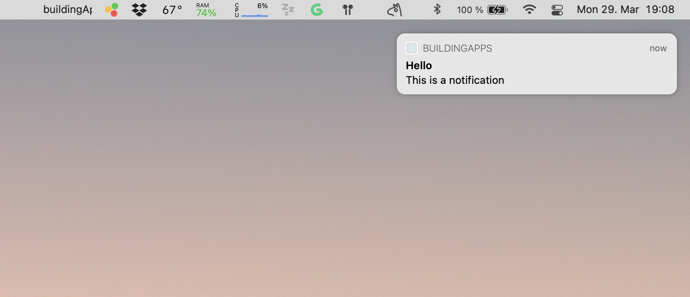

Unlike on mobiles, the only way to send notifications on a mac is directly from an open app. Notifications are a vital feature nowadays. Think of most of the apps you use on your phone; they all use them.

This is a fairly simple process; therefore this lesson is short, but it is included in the course to save you some time researching the APIs.

### Native code

We will start by creating a native method to send a notification from the app itself. This time we will include an optional parameter called URL which will be used by our app to open a browser window. When you trigger the notification from the JavaScript side, you could just store it and read it later, but this will teach you how to send different payloads over the bridge.

{lang=objective-c,crop-start-line=17,crop-end-line=17}
<<[macos/buildingApps-macOS/BuildingAppsNative.m](./protected/macos/buildingApps-macOS/BuildingAppsNative.m)

Its Swift implementation:

{lang=swift,engine=treesitter,crop-start-line=53,crop-end-line=66}
<<[macos/buildingApps-macOS/BuildingAppsNative.swift](./protected/macos/buildingApps-macOS/BuildingAppsNative.swift)

You can see we are attaching our URL into a `userInfo` object. This object is dynamic and you don't need to worry about typing it - the bridge should take care of parsing the data for you to read on the JavaScript side. You can also see we've added two string parameters, one for the title and one for the payload.

If you want to customize your notification further, you can take a look into the [Apple documentation](https://developer.apple.com/documentation/foundation/nsusernotification).

### JavaScript side

The JavaScript side is even simpler. Just add it to our native object and call it from anywhere in your app.

{lang=typescript,crop-query=.sendNotification}
<<[src/libs/BuildingAppsNative.ts](./protected/src/libs/BuildingAppsNative.ts)

:::important
There is one thing to notice here. If you try to run this directly from your app running on XCode it might not work. You may need to first package your app and execute it there. The user will see a prompt on the top right corner of the screen, select options and then accept to receive notifications (not unlike iOS). (The Big Sur UI is terrible and has a tiny button, but nothing we can do about that.)
:::

Now, if you send a notification and you click on it... nothing will happen. We need to handle the "notification opened" event. For now we will do this only on the native side, but in the next (and final) lesson we will dive into event emitters, so we can handle notifications from JavaScript itself.

### Handling clicking on a notification

In order to do receive the click event of our notification, we first need to further extend `AppDelegate` and add `NSUserNotificationCenterDelegate` to the list of classes:

{lang=swift,engine=treesitter,crop-start-line=5,crop-end-line=5}
<<[macos/buildingApps-macOS/AppDelegate.swift](./protected/macos/buildingApps-macOS/AppDelegate.swift)

At the end of the `didFinishLaunchingWithOptions` methods, we will register our instance as the delegate:

{lang=swift,engine=treesitter,crop-start-line=54,crop-end-line=54}
<<[macos/buildingApps-macOS/AppDelegate.swift](./protected/macos/buildingApps-macOS/AppDelegate.swift)

Since we have extended the Notification delegate class, we can now implement the necessary method to handle the notification event:

{lang=swift,engine=treesitter,crop-start-line=58,crop-end-line=68}
<<[macos/buildingApps-macOS/AppDelegate.swift](./protected/macos/buildingApps-macOS/AppDelegate.swift)

Let's dive into the code. 

First things first, the name and the parameters of the function are mandatory. You cannot change them in order to extend the `NSUserNotificationCenterDelegate` class.

Inside the body of the function we access the `userInfo` property of the notification object - remember, we added it in our bridged function.  

We then check if the urlString is empty, and if not we call the `NSWorkspace.shared.open` function. This will tell the OS to open the URL - which program it will open is directly controlled by the OS. If there is no URL attached then we just call our `togglePopover` function to show our menu bar app.