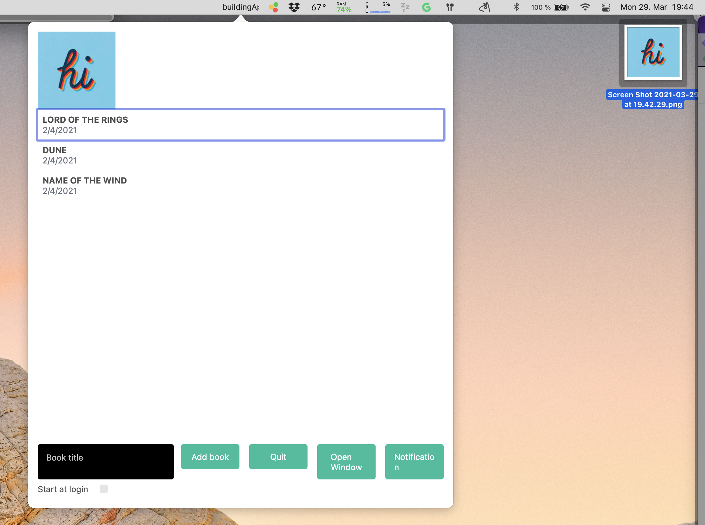

Now that we have taking care of registering our UI component to be droppable, we now need to get the drop events into the JavaScript side of things.

### Emitting events via the bridge

In order to achieve this we will need to turn our native module into an event emitter, and we're going to be clever about this. Even though it is the native object that needs to dispatch the events, we will create a wrapper "emitter" class, to provide an abstraction layer that you can easily expand to handle more events.

Start by creating a `BuildingAppsEmitter` Swift class in the root of the macOS folder.

{lang=swift,engine=treesitter}
<<[macos/buildingApps-macOS/BuildingAppsEmitter.swift](./protected/macos/buildingApps-macOS/BuildingAppsEmitter.swift)

In the body of our class we start by created a `sharedInstance` - this is a common macOS pattern for certain objects that require just a single instance to send/handle events. It's just a convenience object.

Afterwards, you can see it has a static emitter property. This needs to be an instance of our bridged objects, on which we will register once our native object is instantiated. It is important to know that this is more or less the standard way for Swift to handle shared instances (it might remind you of the `NSUserNotificationCenter` we used in the Sending Notifications chapter).

We need to have an empty `init` constructor; no need to put anything in here. We then create a function `registerEmitter` to pass our instantiated bridge class which the class will use to dispatch the events. Along with it we create a `dispatch` function, which is again just convenience around the emitter object for us to send events.

Finally we add one more method `dispatchFileDropped`, which just wraps the dispatch function with a hardcoded `name`, again syntax sugar to make our lives a bit easier, but you can add more events there, and we send a `body`, which will be converted into a JavaScript object.

### Turning our bridge into an event emitter

We will start by exposing our new class to Swift via the native bridging file:

{lang=objective-c}
<<[macos/buildingApps-macOS/buildingApps-macOS-Bridging-Header.h](./protected/macos/buildingApps-macOS/buildingApps-macOS-Bridging-Header.h)

Afterwards we can modify the macro generator file: instead of extending `NSObject` it will now need to extend the `RCTEventEmitter` class:

{lang=objective-c,crop-start-line=2,crop-end-line=4}
<<[macos/buildingApps-macOS/BuildingAppsNative.m](./protected/macos/buildingApps-macOS/BuildingAppsNative.m)

We should also expose a new method, that will tell JavaScript which events are supported:

{lang=objective-c,crop-start-line=20,crop-end-line=20}
<<[macos/buildingApps-macOS/BuildingAppsNative.m](./protected/macos/buildingApps-macOS/BuildingAppsNative.m)

Afterwards we can modify our implementation. Again we change the base class from `NSObject` into `RCTEventEmitter`, and also override the `init` function, so we register the instance on our emitter wrapper:

{lang=swift,engine=treesitter,crop-start-line=7,crop-end-line=24}
<<[macos/buildingApps-macOS/BuildingAppsNative.swift](./protected/macos/buildingApps-macOS/BuildingAppsNative.swift)

So, again, don't forget to change the base class to the `RCTEventEmitter` one. Afterwards on the `init` constructor, we react into our emitter object and register the `self` property (this specific instance) to be the emitter. We then add the `supportedEvents` function, which will be the list of **events** our JavaScript code will be able to register to listen to events.

### Listening for file dropped events

Listening for events on JavaScript is easy, however it will require some changes to our native wrapper. Previously we created a class to wrap our native interfaces, this was done to help us with encapsulation, however we now **need** to use a class, because we need to extend the `NativeEventEmitter` provided by React Native:

{lang=typescript}
<<[src/libs/BuildingAppsNative.ts](./protected/src/libs/BuildingAppsNative.ts)

Start by importing the `NativeEventEmitter` class from React Native, then on the class definition change it to `extends NativeEventEmitter`. That's it - you don't need to manually create the functions to register listeners for the events (`addListener` and `removeListener`), they are part of the `NativeEventEmitter` class.

In our UI store, we can now register our listener. For now we will just do a dummy implementation and put the URL somewhere in our store so we can display it in our UI. Let's start by creating a new observable that will just hold a URL (a string) that we will use to display the image in our app:

{lang=typescript,crop-query=.imageUrl}
<<[src/stores/UI.store.ts](./protected/src/stores/UI.store.ts)

Then, after the UI store hydrate function:

{lang=typescript,crop-start-line=102,crop-end-line=110}
<<[src/stores/UI.store.ts](./protected/src/stores/UI.store.ts)

From our native object we call the `addListener` function. We use the same name we used when creating the native code `fileDropped`. The callback function will be invoked with the payload object we pass from our native code. Since this is a function that can fire at any time and we are modifying an observable, we need to wrap the code in a `runInAction` callback. We simply pluck the URL from the payload object and store it in a variable!

Afterwards you can do whatever you want with this file! Just as an example we will display our main Books container:

{lang=typescript,crop-start-line=33,crop-end-line=37}
<<[src/container/Books.container.tsx](./protected/src/container/Books.container.tsx)

So now if you drag and drop an image from your computer into the status bar button, it should be displayed in our app:

